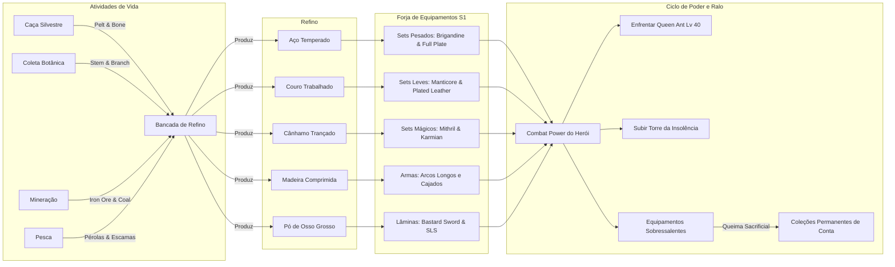

# ADEN ARENA — LIFE ACTIVITIES DEEP DESIGN AUDIT
**Documento:** Auditoria Especializada de Sistemas de Vida, Coleta, Caça, Mineração, Pesca e Produção  
**Fase:** Fase 2 — Da Coleta ao Design Estrutural  
**Data:** 16 de Setembro de 2026  
**Status:** CANÔNICO / AUDITADO / NÃO-INVASIVO  
**Objetivo Fundamental:** Garantir que as atividades de vida não sejam apenas um ciclo passivo de `CLICK → WAIT → RECEIVE ITEM`, mas sim uma experiência completa de `PREPARE → CHOOSE → EXECUTE → REACT → RISK → RESULT → REWARD → PROGRESS`.

---

## 1. VISÃO GERAL DO ECOSSISTEMA DE VIDA (LIFE ACTIVITIES 2.0)

O Aden Arena possui uma infraestrutura de profissões de vida significativamente mais rica que a do Lineage II original. O repositório implementa cinco grandes disciplinas ativas geridas pela abstração central `LifeActivityCore.js`:
1. **Pesca Esportiva e de Sobrevivência (`FishingService.js`)**
2. **Caça Silvestre e Curtume (`HuntingService.js`)**
3. **Coleta Botânica e Fitoterapia (`GatheringService.js`)**
4. **Mineração e Prospecção Subterrânea (`MiningService.js`)**
5. **Expedições Estratégicas de Mercenários (`ExpeditionService.js`)**
Complementadas por:
- **Bancada de Refino de Materiais (`RefineryService.js`)**
- **Sistema Manor Feudal (`ManorService.js`)**

Abaixo realizamos a autópsia técnica individual de cada atividade.

---

## 2. AUDITORIA INDIVIDUAL DAS ATIVIDADES DE VIDA

---

### 2.1 PESCA (FISHING)

```text
CURRENT STATE:
Implementado no FishingService.js (736 linhas) e FishingUI.js. Conta com catálogo de 8 zonas por nível (Costa de Talking Island, Gludin, Dion, Giran, etc.), 4 perfis de combate de peixes (calm, agile, fierce, titan), varas de pesca (Rods) com durabilidade decrescente e 4 tipos de isca (Bait).

CURRENT LOOP:
1. Selecionar Zona adequada ao nível de pesca.
2. Equipar vara e selecionar isca do inventário.
3. Lançar a linha (castLine) -> aguarda fisgada.
4. Ao fisgar peixe comum/raro: inicia combate em turnos (startFight).
5. O jogador escolhe a cada turno: Reel (recolher linha), Yield (ceder linha quando a tensão sobe), Force (puxar com força arriscando romper) ou Rest (recuperar fôlego).
6. Peixe derrotado -> captura bem-sucedida; linha rompida ou peixe exausto que escapa -> falha.
7. Modo Auto-Fish disponível com resolução simulada baseada em chances do fishingBalance.js.

CURRENT REWARDS:
Peixes catalogados (Carpa-Cruzeiro, Robalo-Espada, Lula-de-Aden, Salmão-Titã). Cada peixe possui peso, raridade, valor de venda em ouro e recompensa em material primário (ex.: Carpa concede Galho Silvestre; peixes raros concedem escamas e pérolas).

CURRENT RESOURCES:
- Consumo: Durabilidade da vara (1 ponto por tentativa), Iscas (1 consumida por tentativa), Adena para reparo de vara.
- Geração: Peixes, escamas, pérolas e EXP de pesca.

CURRENT DECISIONS:
- Escolha da isca certa para o peixe desejado (Isca de Minhoca vs Isca Mágica Brilhante).
- Decisão tática em tempo real no minigame (Reel vs Yield vs Force com base na barra de tensão).

CURRENT RISKS:
- Ruptura da linha de pesca e perda da isca.
- Quebra da vara por durabilidade zerada (bloqueia novas pescarias até o reparo).

CURRENT FAILURE STATES:
- Falha na fisgada (tempo esgotado).
- Ruptura de tensão da linha durante a briga com o peixe.

CURRENT PROGRESSION:
Nível de Pesca (1 a 40) que desbloqueia zonas mais profundas e permite equipar varas avançadas (Vara de Bambu -> Vara de Mithril).
```

**Avaliação dos 12 Eixos de Design (Pesca):**
- *Preparation*: **Excelente** (requer checagem de durabilidade da vara e compra de iscas).
- *Player Choice*: **Muito Alta** (escolha de zona, isca e postura no minigame).
- *Risk*: **Moderado** (perda de isca e desgaste de equipamento).
- *Failure*: **Presente** (peixe escapa por tensão excessiva).
- *Reward*: **Parcial** (peixes vendem por ouro, mas falta utilidade culinária para consumíveis).
- *Resource Consumption*: **Ativo** (isco e ouro de reparo).
- *Mastery*: **Alto** (aprender o padrão de comportamento de peixes do tipo 'titan').
- *Progression*: **Sólida** (Lv 1–40 com curvas de XP dedicadas).
- *Replayability*: **Alta** (combate interativo e recompensas raras).
- *Interaction with Economy*: **Média** (gera ouro, mas peixes raros poderiam ser vendidos no Mercado P2P).
- *Interaction with Crafting*: **Fraca** (poucas receitas utilizam espólios de peixes).
- *Offline/AFK*: **Funcional** (simulação determinística com cap de durabilidade).

---

### 2.2 CAÇA SILVESTRE & CURTUME (HUNTING)

```text
CURRENT STATE:
Implementado no HuntingService.js (683 linhas) e HuntingUI.js. Cobre 6 zonas florestais, presas da fauna de Aden (Lebre, Raposa, Cervo, Javali, Urso, Lobo Alfa), facas de caça com durabilidade, 4 tipos de iscas aromáticas (Lures), 4 táticas de aproximação furtiva e mecânica de direção do vento.

CURRENT LOOP:
1. Escolha da zona e análise do vento (Norte, Sul, Leste, Oeste).
2. Equipar faca de caça e aplicar isca aromática.
3. Iniciar rastreamento (startTracking): jogador escolhe tática de aproximação (Stalking contra o vento, Ambush em clareiras, Rush agressivo, Pheromone trap).
4. Confronto com a presa: sucesso no abate abre a etapa de esfolamento e corte em campo (finishSkinning / executeFieldButchering).
5. O jogador escolhe focar em extrair Peles Perfeitas (Pelt/Leather) ou Cortes de Carne e Ossos (Meat/Bone).

CURRENT REWARDS:
Pelts (peles cruas), Leather (couro curtido), Bones (ossos de fera), Suede (camurça) e carnes silvestres. Permuta de peles no curtume de caçadores por Adena e materiais refinados.

CURRENT RESOURCES:
- Consumo: Durabilidade da faca de caça, iscas aromáticas, Adena para amolar a faca.
- Geração: Pelt, Bone, Suede, Leather, Cord.

CURRENT DECISIONS:
- Ajuste da tática de aproximação com base na rosa dos ventos.
- Decisão entre abate focado em couro nobre ou osso para forja.

CURRENT RISKS:
- Fuga da presa por aproximação a favor do vento (odor detectado).
- Danificação da pele por esfolamento incorreto.
- Fera agressiva ferir o caçador.

CURRENT FAILURE STATES:
- Presa espantada antes do alcance.
- Rendimento mínimo de carcaça por esfolamento imperfeito.

CURRENT PROGRESSION:
Nível de Caçador (1 a 40) que desbloqueia feras lendárias e facas de precisão de aço e mithril.
```

**Avaliação dos 12 Eixos de Design (Caça):**
- *Preparation*: **Excelente** (leitura do vento, faca e isca).
- *Player Choice*: **Muito Alta** (tática de aproximação e prioridade de corte).
- *Risk*: **Alto** (alerta da presa e perda de tempo).
- *Failure*: **Presente** (presa foge aofarejando o caçador).
- *Reward*: **Muito Boa** (alimenta diretamente o couro e ossos do jogo).
- *Resource Consumption*: **Ativo** (durabilidade de lâminas e reagentes).
- *Mastery*: **Alto** (domínio da rosa dos ventos e hábitos de cada presa).
- *Progression*: **Sólida** (Lv 1–40).
- *Replayability*: **Alta**.
- *Interaction with Economy*: **Forte** (gera a base das armaduras leves).
- *Interaction with Crafting*: **Excelente no refino**, mas bloqueada na forja final.
- *Offline/AFK*: **Funcional**.

---

### 2.3 COLETA BOTÂNICA & FITOTERAPIA (GATHERING)

```text
CURRENT STATE:
Implementado no GatheringService.js (610 linhas) e GatheringUI.js. Apresenta zonas de vegetação de Gludio, Dion e Giran, nós de flora botânica (Galhos, Hastes, Ervas Medicinais, Fungos Alucinógenos), foices de colheita, bolsas de botânico com preservação de umidade, táticas de colheita (Delicate, Fast, Deep, Sap-Bleed) e perigos ambientais (Espinhos venenosos, Esporos alérgicos).

CURRENT LOOP:
1. Selecionar zona de colheita e nó vegetal.
2. Inspecionar nó (inspectNode): avalia sinais botânicos (seiva fresca, casca seca, pólen tóxico).
3. Selecionar tática de colheita adequada ao sinal.
4. Iniciar extração (startHarvest): se houver risco de perigo, reagir para mitigar dano.
5. Concluir extração: recebe galhos, hastes, fibras e sementes raras.

CURRENT REWARDS:
Branch (galho resistente), Stem (caule), Charcoal (madeira para carvão), seivas destiladas e ervas medicinais.

CURRENT RESOURCES:
- Consumo: Durabilidade da foice, bolsas preservadoras, Adena para afiação.
- Geração: Branch, Stem, Charcoal, Varnish.

CURRENT DECISIONS:
- Escolha da técnica de corte para evitar ruptura de bolsas de seiva.
- Decisão de colher rápido com risco de perda de rendimento ou colheita delicada.

CURRENT RISKS:
- Contaminação por esporos tóxicos (reduz o rendimento e fere o coletor).
- Destruição acidental do nó por corte brusco.

CURRENT FAILURE STATES:
- Perda do nó por corte incorreto.
- Colheita murcha de baixa qualidade.

CURRENT PROGRESSION:
Nível de Botânico (1 a 40) que desbloqueia foices cirúrgicas e acesso a fungos raros de Dion e Cruma.
```

**Avaliação dos 12 Eixos de Design (Coleta):**
- *Preparation*: **Muito Boa** (foice e bolsas de umidade).
- *Player Choice*: **Alta** (inspeção de sinais botânicos e táticas).
- *Risk*: **Moderado** (espinhos e perigos ambientais).
- *Failure*: **Presente** (destruição do nó e contaminação).
- *Reward*: **Essencial** (alimenta madeira, fibras e vernizes).
- *Resource Consumption*: **Ativo**.
- *Mastery*: **Médio** (interpretação de sinais visuais do nó).
- *Progression*: **Sólida** (Lv 1–40).
- *Replayability*: **Alta**.
- *Interaction with Economy*: **Forte**.
- *Interaction with Crafting*: **Excelente no refino**.
- *Offline/AFK*: **Funcional**.

---

### 2.4 MINERAÇÃO & VEIOS SUBTERRÂNEOS (MINING)

```text
CURRENT STATE:
Implementado no MiningService.js (622 linhas) e MiningUI.js. Apresenta galerias subterrâneas de carvão, ferro e prata em Gludio e Dwarven Mines, nós de minério, picaretas com desgaste, lamparinas de mineiro (para iluminação de gás escuro), táticas de percussão e mecânica de escoramento de galerias contra desabamentos.

CURRENT LOOP:
1. Selecionar galeria subterrânea e inspecionar estabilidade da rocha.
2. Sondar o veio mineral (probeVein): detecta densidade da rocha e bolsões de gás inflamável.
3. Se o risco de colapso estiver alto: escorar a galeria (shoreUpGallery) usando madeira comprimida.
4. Escolher tática de quebra (Light Chipping para pedras preciosas, Heavy Striking para ferro bruto, Pneumatic Pounding para carvão denso).
5. Extrair minério (finishMining): gera minérios puros e pepitas reluzentes.

CURRENT REWARDS:
Iron Ore (minério de ferro), Coal (carvão mineral), Silver Nugget (pepitas de prata), Mithril Ore (minério de mithril) e pedras brutas.

CURRENT RESOURCES:
- Consumo: Durabilidade da picareta, óleo de lamparina, madeira para escoras.
- Geração: Iron Ore, Coal, Silver Nugget, Mithril Ore, Adamantite.

CURRENT DECISIONS:
- Gastar madeira para escorar a galeria ou arriscar minerar em galeria instável.
- Seleção de picareta de precisão (para gemas) vs picareta pesada (para ferro).

CURRENT RISKS:
- Desabamento de teto rochoso (bloqueia o veio e causa dano severo).
- Explosão de bolsão de gás por faísca da picareta.

CURRENT FAILURE STATES:
- Colapso da galeria com destruição do veio de minério.
- Desgaste catastrófico da picareta.

CURRENT PROGRESSION:
Nível de Minerador (1 a 40) que desbloqueia picaretas de aço temperado e veios de prata e mithril profundo.
```

**Avaliação dos 12 Eixos de Design (Mineração):**
- *Preparation*: **Excelente** (lamparina, picareta e escoras de madeira).
- *Player Choice*: **Muito Alta** (sondagem de veio, decisão de escoramento e tática de impacto).
- *Risk*: **Alto** (desabamento de teto e perda do veio).
- *Failure*: **Presente e impactante**.
- *Reward*: **Crucial** (o ferro e carvão formam a espinha dorsal de armaduras pesadas e espadas).
- *Resource Consumption*: **Ativo** (consome inclusive produtos de madeira da Coleta!).
- *Mastery*: **Muito Alto** (gestão de estabilidade geológica).
- *Progression*: **Sólida** (Lv 1–40).
- *Replayability*: **Alta**.
- *Interaction with Economy*: **Forte**.
- *Interaction with Crafting*: **Excelente no refino**, mas bloqueada na forja de armas.
- *Offline/AFK*: **Funcional**.

---

### 2.5 EXPEDIÇÕES ESTRATÉGICAS DE MERCENÁRIOS (EXPEDITIONS)

```text
CURRENT STATE:
Implementado no ExpeditionService.js (384 linhas) e MercenaryService.js. O jogador recruta mercenários na Taverna de Aden com raridades (Comum a Lendário), especializações táticas (Guerreiro, Ladino, Mago, Batedor, Curandeiro) e traços de personalidade (Brave, Cautious, Greedy, Ruthless).

CURRENT LOOP:
1. Selecionar destino de expedição (Ruínas de Despair, Acampamento Abandonado, Cavernas de Mithril).
2. Montar esquadrão de 3 mercenários: o sistema calcula sinergias táticas (calculateSquadSynergies).
3. Definir diretriz de risco (Cautious: menor perda, Conservative: equilibrado, Aggressive: maior ganho/maior risco).
4. Despachar esquadrão: cronômetro de tempo real (15 min a 4 horas).
5. Durante o trajeto: o esquadrão pode disparar um Dilema de Expedição (resolveDilemma) exigindo escolha moral do jogador (ex.: "Encontramos uma caravana atacada: salvar os civis ou pilhar a carga?").
6. Concluir expedição: recolhe espólios raros, gemas, baús de suprimentos e experiência de mercenários.

CURRENT REWARDS:
Baús de suprimentos, Gemstones D e C, moedas antigas, fórmulas de refino raras e itens de prestígio.

CURRENT RESOURCES:
- Consumo: Adena para contratação de mercenários, rações de viagem.
- Geração: Gemstones, baús de tesouro, materiais nobres.

CURRENT DECISIONS:
- Composição tática do trio para atingir os requisitos de poder da masmorra.
- Escolha da resposta aos dilemas éticos que afetam a recompensa final.

CURRENT RISKS:
- Falha na expedição por poder de esquadrão insuficiente.
- Perda de recompensa ou ferimento de mercenários por escolhas arriscadas em dilemas.

CURRENT FAILURE STATES:
- Retorno de mãos vazias com mercenários feridos.

CURRENT PROGRESSION:
Nível dos mercenários, reputação da guilda e desbloqueio de masmorras de alto risco.
```

**Avaliação dos 12 Eixos de Design (Expedições):**
- *Preparation*: **Excepcional** (montagem de equipe e sinergias).
- *Player Choice*: **Máxima** (equipe, diretriz de risco e resolução de dilemas).
- *Risk*: **Moderado a Alto**.
- *Failure*: **Presente**.
- *Reward*: **Excelente**.
- *Resource Consumption*: **Ativo**.
- *Mastery*: **Muito Alto**.
- *Progression*: **Sólida**.
- *Replayability*: **Muito Alta**.
- *Interaction with Economy*: **Forte**.
- *Interaction with Crafting*: **Fonte de Gemstones para inserções de Soul Crystals**.
- *Offline/AFK*: **Perfeito para idle**.

---

### 2.6 BANCADA DE REFINO (REFINERY SERVICE)

```text
CURRENT STATE:
Implementado no RefineryService.js (353 linhas) e RefineryUI.js. Apresenta 12 receitas de processamento industrial:
1. Madeira & Fibras: Compressed Wood, Varnish, Cord, Braided Hemp.
2. Curtume & Couros: Leather, Crafted Leather, Coarse Bone Powder.
3. Metalurgia & Fundição: Steel (consome Iron Ore + Coal), Steel Ingot, Silver Mold.
4. Alquimia & Fios: Cotton Thread, Silver Thread, Varnish of Purity.

O serviço suporta refino unitário e refino em massa (refineAll) com cálculo O(1) de capacidade máxima de produção.
```

---

## 3. A TRANSFORMAÇÃO DO LOOP: DE PASSIVO A DECISÓRIO

O quadro abaixo resume a evolução proposta para que nenhuma atividade de vida opere sob o modelo empobrecido de clique passivo:

| Fase da Atividade | Como Funciona Hoje no Aden Arena | Como Deve Operar com Base no Princípio Canônico |
|:---|:---|:---|
| **1. PREPARE** | Comprar ferramentas básicas e iscas na loja. | Inspecionar a durabilidade da ferramenta, escolher o reagente correto (isca, óleo de lamparina, bolsa botânica) e verificar condições ambientais (vento, estabilidade da rocha). |
| **2. CHOOSE** | Clicar no botão da atividade. | Selecionar a zona adequada, a tática de abordagem (Delicate vs Fast; Heavy vs Light Strike) e a diretriz de risco. |
| **3. EXECUTE** | Temporizador de contagem regressiva simples. | Acionamento interativo: lançamento da linha de pesca, sondagem do veio mineral ou esfolamento em campo. |
| **4. REACT** | Nenhuma reação em tempo real no modo idle. | Minigame reativo (barra de tensão de pesca) ou gestão de eventos imprevistos (escorar teto para evitar desabamento). |
| **5. RISK** | Apenas perda de tempo se a conexão oscilar. | Risco real e mensurável: ruptura de linha, alerta da presa com fuga, desabamento de galeria rochosa, quebra de ferramenta. |
| **6. RESULT** | Retorno fixo do item. | Rendimento variável por qualidade (Pobre, Comum, Perfeito) e acúmulo de pontos no Pity System em caso de falha. |
| **7. REWARD** | Item vai para o inventário e muitas vezes fica órfão. | O recurso obtido alimenta a bancada de refino que, por sua vez, alimenta a forja dos melhores equipamentos da temporada. |
| **8. PROGRESS** | Aumento de XP da profissão. | Desbloqueio de novas zonas, ferramentas superiores, bônus de rendimento e maestria de classe. |

---

## 4. O ELO DE OURO: A CADEIA INTEGRADA DE PRODUÇÃO DA SEASON 1

Para que as Life Activities atinjam seu potencial pleno na Season 1, a cadeia de suprimentos deve operar sob um ciclo fechado e autossustentável:



---
**Fim da Auditoria de Life Activities.**
