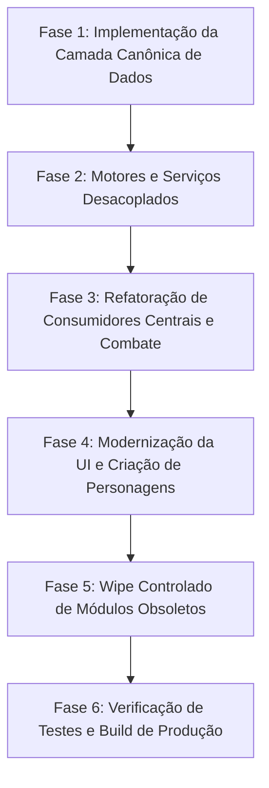

# 📋 RELATÓRIO DE MIGRAÇÃO DO SISTEMA DE CLASSES
## Aden Arena — Controlled Wipe & Rebuild Execution Report

> **Status:** PLANEJADO & AUDITADO  
> **Estratégia:** Wipe Controlado de Estruturas Legadas + Migração Sem Perdas de Dados do Usuário

---

## 1. ESCOPO DO WIPE CONTROLADO

A reconstrução do sistema de classes do Aden Arena elimina de forma definitiva a fragmentação histórica entre 4 modelos de dados conflitantes.

### A. O Que Será Totalmente Removido (Wipe)
1. **`src/data/classes/*.js`** (9 arquivos obsoletos de classes modulares da V1).
2. **`lineage-idle/src/data/classes/classes_echo_defs.js`** (Monólito legado de 305 KB com habilidades embutidas).
3. **`lineage-idle/src/data/classes/class_aliases.js`** (Dicionário com 400+ aliases redundantes).
4. **Strings hardcoded de inspeção textual** (`className.includes('mage')`, `class === 'fighter'`, `class === 'duelist'`).
5. **IDs sintéticos no criador de personagens** (`wargBase`, `assassinS0`, `rider`, `marauderBase`, etc.).

### B. O Que Será Preservado Intacto (Pilares Sagrados)
1. **`LevelEngine.js`**: Curva monotônica de XP e fórmulas de nível (1–40).
2. **`MarketService.js`**: Sistema de mercado (10 slots, 5% de taxa).
3. **`ExpeditionService.js`**: Lógica de expedições e recompensas AFK.
4. **Saves existentes de jogadores**: Perfis locais e em nuvem contendo classes legadas serão migrados automaticamente na carga via `ClassSaveMigrator`.

---

## 2. PLANO DE MIGRAÇÃO DE SAVES EXISTENTES (`ClassSaveMigrator.js`)

Para garantir compatibilidade regressiva sem comprometer o novo sistema limpo, o `ClassSaveMigrator` interceptará a leitura do save no `StateManager.js`:

| ID Legado no Save | ID Canônico Mapeado | Raça | Estágio |
| :--- | :--- | :--- | :--- |
| `fighter` / `humanFighter` | `fighter` | `human` | 0 |
| `mage` / `humanMage` | `mage` | `human` | 0 |
| `deathPilgrim` / `human_deathpilgrim` | `human_deathknight_0` | `human` | 0 |
| `wargBase` / `human_warg` | `werewolf_0` | `human` | 0 |
| `assassinS0` / `human_assassin` | `secret_assassin_male_0` | `human` | 0 |
| `elfFighter` | `elven_fighter` | `elf` | 0 |
| `elfMage` | `elven_mage` | `elf` | 0 |
| `darkElfFighter` | `dark_fighter` | `darkelf` | 0 |
| `darkElfMage` | `dark_mage` | `darkelf` | 0 |
| `bloodRoseBase` | `blood_rose_0` | `darkelf` | 0 |
| `orcFighter` | `orc_fighter` | `orc` | 0 |
| `orcMage` | `orc_mage` | `orc` | 0 |
| `rider` / `orcRider` | `orc_rider_0` | `orc` | 0 |
| `dwarfFighter` | `artisan` | `dwarf` | 0 |
| `shineMakerBase` | `shinemaker_0` | `dwarf` | 0 |
| `kamaelSoldier` | `trooper` | `kamael` | 0 |
| `samuraiBase` | `samurai_0` | `kamael` | 0 |
| `sylphGunner` | `sylph_gunner_0` | `sylph` | 0 |
| `divineTemplarBase` | `high_elf_templar_0` | `highelf` | 0 |
| `elementWeaverBase` | `high_elf_weaver_0` | `highelf` | 0 |
| `marauderBase` | `ertheia_fighter_0` | `ertheia` | 0 |
| `sayhaMageBase` | `ertheia_mage_0` | `ertheia` | 0 |

---

## 3. FASES DE EXECUÇÃO DO REBUILD

### Detalhamento das Fases:
- **Fase 1: Dados Canônicos**: Criação de `CanonicalClassRegistry.js` (159 nós) e `CanonicalClassGraph.js` (estruturas e travessias DAG).
- **Fase 2: Motores**: Criação de `ClassProgressionEngine.js`, `ClassValidationService.js` e `ClassSaveMigrator.js`.
- **Fase 3: Combate & Status**: Atualização de `StatsEngine.js` (`getClass`), `CombatEngine.js` (`isMageClass`), `StateManager.js` (`applyStarterKit`), `EquipmentService.js` e `SkillEligibility.js`.
- **Fase 4: UI**: Conectar `CharacterCreation.tsx` e `GameUI.js` às APIs dinâmicas do `ClassGraph`.
- **Fase 5: Wipe**: Excluir `src/data/classes/*.js`, esvaziar/aposentar `classes_echo_defs.js`, limpar aliases obsoletos.
- **Fase 6: Validação**: Rodar os 545 testes automatizados, validar cobertura total de 159 classes e checar integridade de compilação via `npm run build`.
