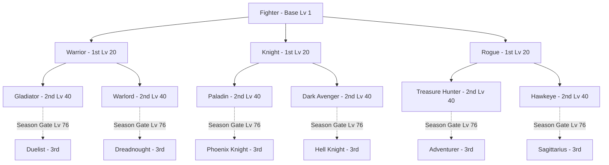

# 🏛️ ARQUITETURA DO SISTEMA CANÔNICO DE CLASSES
## Aden Arena — Single Source of Truth & Data-Driven Class Graph

> **Pilar Arquitetural:** DATA ≠ ENGINE ≠ UI  
> **Status:** ESPECIFICAÇÃO OFICIAL E DEFINITIVA  
> **Cobertura:** 9 Raças, 49 Linhagens, 159 Classes Únicas, 149 Transições Válidas

---

## 1. PRINCÍPIOS FUNDAMENTAIS DE DESIGN

O novo sistema de classes do Aden Arena substitui completamente o modelo legado monolítico baseado em dicionários com skills embutidas e verificações manuais de string. A nova arquitetura é governada por três princípios inegociáveis:

1. **Separação Rígida de Responsabilidades (DATA ≠ ENGINE ≠ UI)**:
   - **DATA Layer**: Grafo puro e registros imutáveis (`CanonicalClassRegistry.js`, `CanonicalClassGraph.js`). Sem referências a DOM, sem referências a `window`, sem efeitos colaterais.
   - **ENGINE Layer**: Serviços desacoplados e puros (`ClassProgressionEngine.js`, `ClassValidationService.js`, `StatsEngine.js`). Operam estritamente sobre estruturas de estado e consultam a camada de dados.
   - **UI Layer**: Componentes React (`CharacterCreation.tsx`, `HeroOverview.tsx`) e views modulares (`GameUI.js`, `SkillTreeViewModel.js`). Reativos e puramente consumidores do motor e do grafo.

2. **Topologia Formal de Grafo Acíclico Direcionado (DAG)**:
   - As 159 classes não são listas lineares isoladas. Nós compartilhados (como `fighter` gerando `warrior`, `knight`, `rogue`) são instâncias únicas no grafo com arestas divergentes para sucessores e convergentes para ancestrais.
   - 0 ciclos, 0 órfãos, 0 nós com múltiplos pais. Cada transição de classe requer exatamente 1 nó predecessor válido.

3. **Gating Canônico da Season 1**:
   - Níveis 1 a 40 jogáveis na íntegra (Estágios 0, 1 e 2).
   - Terceiras Classes (Nível 76+) registradas e modeladas formalmente no grafo (`canonical: true`), porém bloqueadas com `available: false, reason: 'season_gate'`.

---

## 2. TOPOLOGIA DO GRAFO CANÔNICO DE CLASSES



### Métricas Consolidadas do Grafo:
- **Total de Raças**: 9 (Human, Elf, Dark Elf, Orc, Dwarf, Kamael, Sylph, High Elf, Ertheia)
- **Total de Linhagens / Branches**: 49
- **Total de Classes Únicas**: 159
- **Estágio 0 (Base Class, Lv 1–19)**: 25 nós (10 raízes compartilhadas + 15 raízes dedicadas)
- **Estágio 1 (1st Class, Lv 20–39)**: 36 nós (12 troncos compartilhados + 24 dedicados)
- **Estágio 2 (2nd Class, Lv 40–75)**: 49 nós (1 por linhagem)
- **Estágio 3 (3rd Class, Lv 76+)**: 49 nós (1 por linhagem)
- **Arestas de Transição**: 149

---

## 3. MODELO DE DADOS DE CADA NÓ DE CLASSE

Cada classe no `CanonicalClassRegistry` possui um esquema rigoroso e padronizado:

```typescript
interface CanonicalClassNode {
  id: string;                    // slug snake_case oficial (ex: "phoenix_knight")
  name: string;                  // Nome canônico oficial (ex: "Phoenix Knight")
  race: string;                  // Identificador da raça (ex: "human")
  stage: 0 | 1 | 2 | 3;          // 0: Base, 1: 1st, 2: 2nd, 3: 3rd
  stageName: string;             // "BASE" | "FIRST_CLASS" | "SECOND_CLASS" | "THIRD_CLASS"
  minLevel: number;              // 1, 20, 40, ou 76
  maxLevel: number;              // 19, 39, 75, ou 120
  parentClass: string | null;    // ID do predecessor direto (null se stage === 0)
  lineageId: string;             // ID da linhagem (slug da 3ª classe correspondente)
  lineageName: string;           // Nome da linhagem (ex: "Phoenix Knight")
  archetype: string;             // "fighter" | "knight" | "rogue" | "archer" | "mage" | "healer" | "summoner" | "enchanter"
  archetypeGroup: 'fighter' | 'mage'; // Grupo macro de combate
  subclassArchetype: string;     // Para cálculo de certificação de subclasses
  weapons: string[];             // Lista de armas recomendadas/canônicas
  armor: string[];               // Lista de armaduras recomendadas/canônicas
  unlockedSkillIds: string[];    // IDs de habilidades introduzidas neste estágio
  baseStats: {                   // Modificadores de status base da classe
    atk: number;
    def: number;
    hp: number;
    mp: number;
    eva: number;
    crit: number;
    matk: number;
    mdef: number;
  };
  seasonGated: boolean;          // true para Stage 3 (Season 1)
  available: boolean;            // true se jogável na Season 1
}
```

---

## 4. MOTOR DE PROGRESSÃO (`ClassProgressionEngine.js`)

O motor de progressão substitui a lógica espalhada por múltiplos arquivos por métodos puros e testáveis:

1. **`getAvailablePromotions(currentClassId, playerLevel)`**:
   - Retorna array de classes candidatas para avanço imediato.
   - Valida se o nível atual atende ao `minLevel` do sucessor e se o sucessor não está com `seasonGated === true`.
2. **`canPromote(currentClassId, targetClassId, playerLevel)`**:
   - Verifica estritamente se `targetClassId` é sucessor direto no grafo e se os requisitos de nível estão satisfeitos.
3. **`executeClassTransfer(state, targetClassId)`**:
   - Atualiza `state.class = targetClassId`.
   - Dispara evento desacoplado `class_transferred`.
   - Concede automaticamente as habilidades iniciais do novo estágio.
4. **`getLineageHistory(classId)`**:
   - Retorna o caminho de classes desde a Base Class até a classe atual `[base, first, second, third]`.

---

## 5. UI DINÂMICA REATIVA

### A. Criador de Personagens (`CharacterCreation.tsx`)
- Não armazena listas estáticas de classes no frontend.
- Consulta `getPlayableBaseClasses(raceId)` do Grafo Canônico.
- Para cada raça selecionada, renderiza dinamicamente as classes base permitidas (ex: Humano exibe Fighter, Mage, Death Knight, Werewolf, Secret Assassin).
- Emite eventos de criação com IDs canônicos limpos (`snake_case`).

### B. Janela de Habilidades (`SkillTreeViewModel.js` & `GameUI.js`)
- Constrói a visualização da árvore de habilidades percorrendo `getLineageHistory(character.class)`.
- As habilidades desbloqueadas nos estágios anteriores são renderizadas como aprendidas ou disponíveis para evolução.
- As habilidades dos estágios futuros aparecem bloqueadas com indicação do nível requerido.
