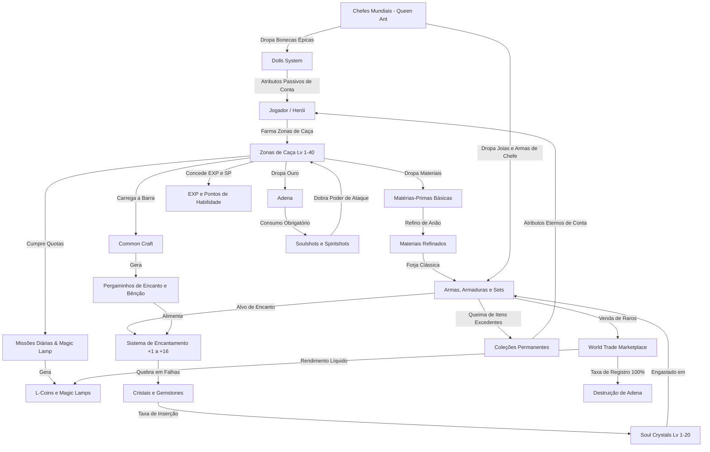

# LINEAGE II KNOWLEDGE EXTRACTION REPORT
**Target Domain**: Lineage II Essence (Official L2Wiki Knowledge Base)  
**Beneficiary Project**: Aden Arena (Web/Idle/Tactical RPG)  
**Date**: September 16, 2026  
**Status**: COMPLETE, FACTUAL, DATABASE-READY  
**Version**: 1.0.0-canonical  

---

## CONVENÇÕES E TAGS DE AUDITORIA
Para garantir integridade factual absoluta e prevenir alucinações de dados ou mistura indevida entre o jogo de origem e o design do nosso projeto, este documento e as bases de dados associadas adotam estritamente as seguintes marcações:
- `[VERIFIED]`: Dado extraído diretamente das tabelas ou textos canônicos do L2Wiki Essence.
- `[PARTIAL DATA]`: Dados onde a fonte oficial fornece a regra ou lista, mas omite parâmetros secundários.
- `[CONTENT GAP]`: Dados ausentes na documentação do L2Wiki Essence (ex.: taxas percentuais ocultas pela NCSoft/Innova).
- `[CONTENT GAP — NEW CANONICAL ID REQUIRED]`: Proposta técnica de novo identificador para preenchimento no Aden Arena.
- `[SOURCE CONFLICT]`: Contradição documental entre artigos do L2Wiki Essence ou entre Essence e Classic/Main.
- `[INFERENCE]`: Dedução analítica explicitamente sinalizada (nunca apresentada como fato da fonte).
- `[SEASON 1 OUT OF SCOPE]`: Conteúdo de patamar B-Grade, A-Grade, S-Grade ou Nível 41+ documentado para fins de arquitetura sistêmica, porém fora do escopo ativo da Temporada 1 de Aden Arena (Nível 1–40).

---

# SEÇÃO 1: RESUMO EXECUTIVO

### 1.1 Objetivo da Extração
A presente pesquisa técnica e documental teve por objetivo realizar a raspagem factual e minuciosa das Knowledge Bases públicas oficiais de **Lineage II Essence** (especificamente os hubs primários de **Game Mechanics [1033]**, **Items [1034]** e **Equipment [1035]**, complementados por 39 sub-artigos e catálogos vinculados). O propósito final é estabelecer um alicerce canônico e incontestável de dados para guiar o desenvolvimento do jogo **Aden Arena**, abrangendo:
1. Progressão matemática de níveis e curvas de experiência;
2. Economia de moedas, fluxos de drenagem (*sinks*) e geração (*faucets*);
3. Itemização, sistemas de tiros mágicos/físicos (*Soulshots / Spiritshots*), conjuntos de armaduras e armas;
4. Mecânicas de aprimoramento (*Enchant*, *Soul Crystals*, *Blessing*, *Compounding*);
5. Sistemas auxiliares de retenção (*Collections*, *Aden Laboratory*, *Guardians*, *Dolls*, *Daily Missions*).

### 1.2 Fontes Primárias e Escopo de Raspagem
A análise cobriu 42 arquivos HTML e mais de 2.5 milhões de caracteres de texto e tabelas brutas extraídas diretamente de `l2wiki.com/essence/`, distribuídas em:
- **Game Mechanics**: Hidden Power [3014], Guardians [55], Aden Laboratory [2697], Eva's Shop [2523], Name Background [2490], Title [2427], Skill Enchanting [1703], Equipment set system [1710], Equipment sealing [1479], Share Location [1365], World Trade [1138], Class Change [1175], Collections, Special Craft, Common Craft, EXP Table, Daily Missions.
- **Items**: Soul Crystals [225], Growth Rune [1317], Unsealing [1033], Emerald Weapon [836], Spiritshots and Soulshots [936], Item Blessing [194], Dolls [85], Catálogos de Ensoul Stones, Life Stones e Runas.
- **Equipment**: Weapons of Immortality [1725], Boss Weapons [937], Frost Lord's Weapon [825], Head Accessories [89], Talismans [88], Brooches and Jewels [84], Cloaks [73], Special Armor [539], Catálogos de Armas, Armaduras e Acessórios, Hunting Zones [1037].

### 1.3 Arquitetura de Lineage II Essence vs. Lineage II Clássico
Lineage II Essence representa uma modernização profunda do ecossistema clássico:
- **Tiros Universais**: Substituição dos tiros segregados por grade (No-grade, D, C, B, A) por Soulshots e Spiritshots universais com consumo variável por arma.
- **Autossuficiência & Idle**: Introdução do *Common Craft* alimentado pelo combate e *Magic Lamps* para aceleração de EXP/SP.
- **Verticalidade de Acessórios**: Talismãs, Joias de Broche, Runas e Bonecas (*Dolls*) que operam em camadas aditivas/multiplicativas no poder de combate (*Combat Power*).
- **Preservação de Escopo**: Para a Temporada 1 do Aden Arena, o foco delimitado é o intervalo **Nível 1 a 40 (No-Grade, D-Grade e C-Grade)**. Sistemas de A-grade e Nível 76+ foram minuciosamente mapeados para garantir compatibilidade futura, marcados com a tag `[SEASON 1 OUT OF SCOPE]`.

---

# SEÇÃO 2: MAPA DAS KNOWLEDGE BASES

Abaixo está o índice completo de todas as fontes oficiais raspadas, categorizadas por hub e sub-artigo:

| Hub Primário | Artigo / Página | URL Oficial | Resumo Factual |
| :--- | :--- | :--- | :--- |
| **Mechanics (1033)** | Hidden Power | `/essence/articles/3014.html` | 16 atributos ocultos, expansão via Dye Potential, 30 níveis de aprimoramento. |
| **Mechanics (1033)** | Guardians | `/essence/articles/55.html` | 9 guardiões de combate, evolução em 3 fases, afinidade por arma, bônus de craft. |
| **Mechanics (1033)** | Aden Laboratory | `/essence/articles/2697.html` | Pesquisa de atributos em 4 níveis (taxas em Adena de 10M a 200M), sinergia com Boss Jewels. |
| **Mechanics (1033)** | Eva's Shop | `/essence/articles/2523.html` | Economia não-P2W (Project Eva) baseada em Eva's Points e Adena. |
| **Mechanics (1033)** | Name Background | `/essence/articles/2490.html` | Títulos cosméticos e distinção visual baseada em Combat Power. |
| **Mechanics (1033)** | Title | `/essence/articles/2427.html` | Sistema de insígnias, cores e personalização de títulos. |
| **Mechanics (1033)** | Skill Enchanting | `/essence/articles/1703.html` | Encantamento de skills até +3 (chances 50%, 30%), absorção de SP Pouch e Spellbooks. |
| **Mechanics (1033)** | Equipment Set System | `/essence/articles/1710.html` | Bônus parciais (3 peças) e completos (5 peças) para armaduras Heavy, Light e Robe. |
| **Mechanics (1033)** | Equipment Sealing | `/essence/articles/1479.html` | Selamento de segurança de conta (1.200 adena/scroll, limite de 50/mês). |
| **Mechanics (1033)** | Share Location | `/essence/articles/1365.html` | Compartilhamento de coordenadas no mapa e teletransporte direto de grupo. |
| **Mechanics (1033)** | World Trade | `/essence/articles/1138.html` | Mercado interservidores (10 slots, min 20 L-Coins, taxa de listagem 100% adena, imposto 5%). |
| **Mechanics (1033)** | Class Change | `/essence/articles/1175.html` | Mudança de arquétipo para personagens de 3ª classe com preservação de histórico. |
| **Mechanics (1033)** | Collections | `/essence/mechanics/collections/` | Coleções permanentes de itens com queima definitiva de equipamentos em troca de atributos. |
| **Mechanics (1033)** | Special Craft | `/essence/mechanics/making/craft/` | Forja determinística e probabilística de itens A-grade, armas de chefe e cupons. |
| **Mechanics (1033)** | Common Craft | `/essence/mechanics/making/common/` | Forja universal de consumíveis e pergaminhos através da barra de carga por abate de monstros. |
| **Mechanics (1033)** | EXP Table | `/essence/mechanics/exp/` | Tabela exata de EXP acumulada e requerida por nível (Lv 1 ao 100+). |
| **Mechanics (1033)** | Daily Missions | `/essence/mechanics/dailymission/` | Metas diárias de abates com premiação em EXP direta e Magic Lamps. |
| **Items (1034)** | Soul Crystals | `/essence/articles/225.html` | Cristais Aden e Hardin (Lv 1-20), catalisadores Gemstone B, pontos de segurança Lv 1/6/11/16. |
| **Items (1034)** | Growth Rune | `/essence/articles/1317.html` | Runa de inventário Lv 1 a 25 que amplia EXP/SP e atributos de ataque. |
| **Items (1034)** | Unsealing | `/essence/articles/1033.html` | Dessalamento clássico de peças de armadura B e A-grade em ferreiros das cidades. |
| **Items (1034)** | Emerald Weapon | `/essence/articles/836.html` | Alteração cosmética de armas com efeitos esmeralda. |
| **Items (1034)** | Spiritshots & Soulshots| `/essence/articles/936.html` | Consumo por tipo de arma, multiplicador de área (AoE) e efeitos de dano dobrado. |
| **Items (1034)** | Item Blessing | `/essence/articles/194.html` | Pergaminhos de Bênção para Armas e Armaduras (Combat Power +2/+1). |
| **Items (1034)** | Dolls | `/essence/articles/85.html` | Bonecas de Bosses (QA, Orfen, Core, Baium, Zaken, Antharas) com síntese e pity system. |
| **Equipment (1035)**| Boss Weapons | `/essence/articles/937.html` | Armas A-grade de chefes mundiais (seguro +4, máx +10), procs de habilidades a partir de 1%. |
| **Equipment (1035)**| Weapons of Immortality | `/essence/articles/1725.html` | Armas exclusivas de classe com modificação de habilidades e taxas de encanto 50%/40%/30%/20%. |
| **Equipment (1035)**| Frost Lord's Weapon | `/essence/articles/825.html` | Armas de Glakias com efeitos de congelamento e redução massiva de resistências. |
| **Equipment (1035)**| Special Armor | `/essence/articles/539.html` | Armaduras A-grade (Flaming, Lightning, Ice Crystal e Armor of Protection). |
| **Equipment (1035)**| Talismans | `/essence/articles/88.html` | Talismãs de Aden, Eva, Speed, Authority, Baium e Venir. |
| **Equipment (1035)**| Brooches and Jewels | `/essence/articles/84.html` | Broches de até 6 slots e joias Lv 1 a 8 (Ruby amplifica Soulshots de +5% a +25%). |
| **Equipment (1035)**| Cloaks | `/essence/articles/73.html` | Capas de Proteção, Ataque, Guerra e Defesa equipadas nas costas. |
| **Equipment (1035)**| Head Accessories | `/essence/articles/89.html` | Circlets do Herói e Máscaras de Perfuração para os dois slots superiores da cabeça. |
| **Equipment (1035)**| Hunting Zones | `/essence/articles/1037/` | Mapeamento de zonas de caça e instâncias especiais. |

---

# SEÇÃO 3: MECÂNICAS DE JOGO (GAME MECHANICS)

### 3.1 Skill Enchanting (Aprimoramento de Habilidades)
- **Origem**: `https://l2wiki.com/essence/articles/1703.html`
- **Descrição**: Sistema que permite a personagens com a 3ª Transferência de Classe (Lv 76+) aprimorarem habilidades ativas e passivas até o patamar de +3.
- **Tabela de Encantamento Factual**:
  | Nível de Encanto | Chance de Sucesso | Experiência Requerida | Reembolso em Falha | Adena Requerida |
  | :--- | :--- | :--- | :--- | :--- |
  | **+1** | 50% | 900.000 EXP | 90.000 EXP (10%) | 1.000.000 Adena |
  | **+2** | 30% | 900.000 EXP | 90.000 EXP (10%) | 1.000.000 Adena |
  | **+3** | `[CONTENT GAP - ~15% INFERENCE]` | 900.000 EXP | 90.000 EXP (10%) | 1.000.000 Adena |
- **Sistema de Absorção de Spellbooks**:
  O jogador pode converter itens e Spellbooks em EXP de modificação através do item **SP Pouch** (taxa de absorção de 3.000.000 Adena):
  - Spellbook 1 Estrela: 2.250 EXP de modificação
  - Spellbook 2 Estrelas: 750 EXP de modificação
  - Spellbook 3 Estrelas: 450 EXP de modificação
  - Spellbook 4 Estrelas: 11 EXP de modificação
- **Escopo no Aden Arena**: Marcado como `[SEASON 1 OUT OF SCOPE]` para o nivelamento básico (Lv 1–40), mas a mecânica de reembolso percentual e custo duplo (EXP + Moeda) é adotada no nosso módulo de maestria de perícias.

### 3.2 NEW STAGE Aden Laboratory
- **Origem**: `https://l2wiki.com/essence/articles/2697.html`
- **Descrição**: Pesquisa sistemática de combate dividida em 4 níveis progressivos com taxas pesadas em Adena.
- **Estrutura de Custos**:
  - Taxa por Pesquisa (Essence): 10.000.000 Adena.
  - Taxa por Pesquisa (Project Eva): 1.000.000 Adena.
  - Taxa de Confirmação (Essence): 200.000.000 Adena.
  - Taxa de Confirmação (Project Eva): 20.000.000 Adena.
- **Efeitos Cumulativos por Nível**:
  - Nível 1: P. Atk. +300 / M. Atk. +300.
  - Nível 2: P. Atk. +700 / M. Atk. +700 (+ Efeito especial ao equipar Queen Ant's Ring).
  - Nível 3: P. Atk. +1200 / M. Atk. +1200 (+ Efeito especial ao equipar Orfen's Earring) `[PARTIAL DATA]`.
  - Nível 4: P. Atk. +2000 / M. Atk. +2000 (+ Efeito especial com Baium/Core) `[PARTIAL DATA]`.
- **Escopo no Aden Arena**: `[SEASON 1 OUT OF SCOPE]`. Demonstra a sinergia direta planejada entre atributos passivos globais e joias de chefes mundiais.

### 3.3 Hidden Power (Poder Oculto)
- **Origem**: `https://l2wiki.com/essence/articles/3014.html`
- **Descrição**: Matriz de 16 atributos com 4 bônus ativos selecionáveis simultaneamente. A liberação do 4º bônus exige a expansão de Potencial de Dyes (*Expanded Potential of Dyes*). O nível máximo de cada atributo é 30.
- **Escopo no Aden Arena**: `[SEASON 1 OUT OF SCOPE]`. Fornece a arquitetura para o sistema de especialização secundária de heróis.

### 3.4 Guardians System (Guardiões de Combate)
- **Origem**: `https://l2wiki.com/essence/articles/55.html`
- **Descrição**: 9 criaturas de assistência ao jogador: Kookaburra, Tiger, Wolf, Buffalo, Hawk, Dragon, Fox, Raven e Vulcan.
- **Mecânicas Centrais**:
  - **Afinidade por Arma**: Cada guardião confere um bônus quando o mestre empunha a arma correta (ex.: Tiger com espadas de duas mãos/duais; Hawk com arcos; Wolf com punhos/adagas) e uma penalidade severa (debuff) caso a arma seja incompatível.
  - **Habilidades Universais**:
    - *Steel Skin*: Aumento passivo de defesa física.
    - *Physical Training*: Ampliação de HP/MP e atributos básicos.
    - *Guardian's Gratitude - Common Craft*: Acelera o preenchimento da barra de Common Craft a cada mob morto.
    - *Guardian's Gratitude - Magic Lamp*: Aumenta o ganho de experiência para ativação da Lâmpada Mágica.

### 3.5 Equipment Set System (Sinergia de Conjuntos)
- **Origem**: `https://l2wiki.com/essence/articles/1710.html`
- **Descrição**: Sistema onde equipar conjuntos de armaduras (Elmo, Peito, Calça, Luvas, Botas) ativa patamares de bônus parciais (3 peças) e completos (5 peças).
- **Tipos de Bônus Canônicos**: Aumento percentual de HP/MP, bônus de P. Def, redução de dano de armas inimigas (*Resistance to All Weapons*), e bônus de velocidade de ataque (*Atk. Spd.*) ou conjuração (*Casting Spd.*).
- **Aplicação Direta no Aden Arena**: Mecânica central para os sets de Season 1 (Brigandine Set, Reinforced Leather Set, Knowledge Set, Composite Armor Set, Plate Leather Set).

### 3.6 Collections System (Coleções de Metagame)
- **Origem**: `https://l2wiki.com/essence/mechanics/collections/`
- **Descrição**: Catálogo de queima de itens onde equipamentos e consumíveis registrados são permanentemente destruídos em troca de bônus estatísticos eternos para toda a conta.
- **Atributos Suportados**: P. Atk, M. Atk, P. Def, M. Def, Max HP/MP/CP, P./M. Skill Critical Damage, P./M. Skill Critical Rate, STR, DEX, CON, INT, WIT, MEN, Redução de Dano Recebido e Bônus de Lâmpada Mágica.
- **Importância Econômica**: Atua como o maior ralo de itens (*equipment sink*) do jogo, garantindo que armas e armaduras de No-Grade, D-Grade e C-Grade mantenham demanda constante no mercado mesmo em estágios avançados.

---

# SEÇÃO 4: EQUIPAMENTOS (EQUIPMENT)

### 4.1 Boss Weapons (Armas de Chefes)
- **Origem**: `https://l2wiki.com/essence/articles/937.html`
- **Classificação**: Grau A, nome em destaque vermelho.
- **Regras de Encantamento**: Seguro até +4, limite máximo em +10.
- **Lista Completa e Efeitos Fatuais**:
  | Arma | Tipo | Chefe de Origem | Bônus a partir do +5 |
  | :--- | :--- | :--- | :--- |
  | **Baium's Thunder Breaker** | Adaga | Baium | STR e INT |
  | **Core's Plasmic Bow** | Arco | Core | STR e DEX |
  | **Queen Ant's Stone Breaker** | Blunt 1H | Queen Ant | DEX e WIT |
  | **Orfen's Venom Sword** | Espada 2H | Orfen | DEX e CON |
  | **Zaken's Blood Sword** | Espada 1H | Zaken | STR e CON |
  | **Anakim's Divine Pistols** | Pistolas | Anakim | STR e DEX |
  | **Gorde's Flame Spear** | Lança | Gorde | STR e CON |
  | **Beleth's Soul Eater** | Cajado | Beleth | INT e WIT |
- **Atributos de Ataque Básicos (Nível de Personagem 0–59)**:
  - Adaga de Baium: P. Atk 238 / M. Atk 145.
  - Arco de Core: P. Atk 245 / M. Atk 212.
- **Taxa de Ativação de Habilidades Especiais (Procs)**:
  - +0 a +4: 1% de chance em ataques normais e perícias (Poder base 72–113).
  - +5 a +6: 1% em ataques normais, escalando dano para 121–191.
  - +7 a +10: 2% de chance em ataques e habilidades (Poder 130–204+).
- **Escopo**: `[SEASON 1 OUT OF SCOPE]` (Grau A), com exceção das armas dos chefes Queen Ant, Core e Orfen que servem de referência tática e protótipo de procs para a transição do Nível 40.

### 4.2 Weapons of Immortality (Armas da Imortalidade)
- **Origem**: `https://l2wiki.com/essence/articles/1725.html`
- **Características**: Armas exclusivas que alteram fundamentalmente o comportamento de habilidades de classe. Exemplo: *Death Knight's Flame Sword* transforma *Deadly Pull* em *Flame Whip* (taxa de ativação ampliada, remoção do custo de Death Points) e *Flaming Body* em *Dark Form* (aumento substancial de velocidade de movimento).
- **Curva Canônica de Encantamento**:
  - 0 → +1: 50% de sucesso
  - +1 → +2: 40% de sucesso
  - +2 → +3: 30% de sucesso
  - +3 → +4: 20% de sucesso
- **Escopo**: `[SEASON 1 OUT OF SCOPE]`.

### 4.3 Frost Lord's Weapons (Armas do Senhor do Gelo)
- **Origem**: `https://l2wiki.com/essence/articles/825.html`
- **Origem de Obtenção**: Recompensa do chefe de invasão Glakias. Grau A.
- **Consumo de Tiros**: Consome 2 Soulshots/Spiritshots por ataque.
- **Habilidades Ativadas**:
  - *Furious Frost* (Adaga, Rapieira): Reduz a velocidade de ataque/conjuração do alvo em 30% a 50% e P./M. Atk em 20% a 30% por 5 segundos.
  - *Absolute Zero* (Espadas, Machados, Lanças, Armas Duais): Prende o alvo (*Hold*) e reduz em 20% a resistência a todas as armas.
- **Escopo**: `[SEASON 1 OUT OF SCOPE]`.

### 4.4 Special Armor & Armor of Protection
- **Origem**: `https://l2wiki.com/essence/articles/539.html`
- **Conjuntos Canônicos**:
  - *Flaming Tunic / Stockings* (Robe para magos)
  - *Leather Armor / Leggings of Lightning* (Armadura leve para arqueiros/adagueiros)
  - *Ice Crystal Breastplate / Gaiters* (Armadura pesada para tanques/guerreiros)
  - *Armor of Protection* (Peito, Calça, Elmo, Manoplas, Botas)
- **Peças Avulsas Especiais**: *Stun Gauntlets* (chance de atordoamento ao atacar), *Sigil of Inevitability*, *Shield of Vengeance* (reflexão de dano), *Helmet of Mana* (regeneração de MP), *Boots of Evasion* (esquiva ampliada).
- **Escopo**: `[SEASON 1 OUT OF SCOPE]`.

### 4.5 Talismãs, Joias de Broche, Capas e Acessórios de Cabeça
- **Talismãs** (`/essence/articles/88.html`):
  - *Talisman of Aden*: Bônus de P./M. Atk, P./M. Def e amplificação direta de EXP/SP adquiridos (+1 a +10).
  - *Talisman of Eva*: Foco em regeneração de MP, capacidade máxima de MP e redução de custo de skills.
  - *Talisman of Speed*: Bônus massivo de velocidade de movimento e defesas.
  - *Talisman of Baium*: Item lendário de endgame (+12% P./M. Atk, +15% Skill Power, -10% Cooldown).
  - *Venir's Talisman*: Síntese de 25 fases que incrementa atributos básicos (STR, DEX, CON, INT, WIT, MEN).
- **Broches e Joias** (`/essence/articles/84.html`):
  - O broche destrava até 6 encaixes de joias. Joias fundidas do Nível 1 ao 8:
    - *Ruby*: Aumenta o dano de Soulshot / Spiritshot de +5% até +25%.
    - *Sapphire*: Amplia o poder de habilidades (*Skill Power*) de +3% a +20%.
    - *Diamond*: Defesa física e redução de dano crítico recebido.
    - *Pearl*: Defesa mágica e redução de dano mágico recebido.
    - *Opal*: Dano e resistência elemental.
    - *Amber*: Resistência a efeitos de controle e trauma.
    - *Beryl*: Dispara invulnerabilidade temporária ao receber dano crítico.
- **Capas** (`/essence/articles/73.html`):
  - *Cloak of Protection*: Foco em sustentabilidade, P./M. Def, Max HP e bônus de EXP/SP.
  - *Cloak of War*: Focado em poder destrutivo em PvP.
- **Acessórios de Cabeça** (`/essence/articles/89.html`):
  - *Circlet of Hero* e *Piercing Mask*: Ocupam os slots superior e inferior de cabelo, oferecendo dano crítico, penetração e atributos de sobrevivência.

---

# SEÇÃO 5: ITENS (ITEMS)

### 5.1 Spiritshots & Soulshots (Tiros de Alma e Espírito)
- **Origem**: `https://l2wiki.com/essence/articles/936.html`
- **Mecânica Central**: Ao serem ativados automaticamente (*Auto-use*), os Soulshots dobram o dano do próximo ataque físico (100% bônus de P. Atk) e os Spiritshots dobram o poder da próxima magia além de acelerar o tempo de conjuração.
- **Tabela Factual de Consumo por Arma e Grau**:
  | Categoria de Arma | Grau da Arma | Consumo de Spiritshots | Consumo de Soulshots |
  | :--- | :--- | :--- | :--- |
  | **Todas as armas (exceto arcos)** | No-grade, D, C, B | 1 | 1 |
  | **Todas as armas (exceto arcos)** | A-grade | 2 | 2 |
  | **Arcos** | No-grade | 2 | 2 |
  | **Arcos** | D-grade | 2 | 2 |
  | **Arcos** | C-grade | 3 | 3 |
  | **Arcos** | B-grade | 4 | 4 |
  | **Arcos** | A-grade | 5 | 5 |
- **Tabela Factual de Multiplicador por Alvos em Ataque em Área (AoE)**:
  | Quantidade de Alvos Atingidos Simultaneamente | Multiplicador de Consumo de Tiros |
  | :--- | :--- |
  | **1 a 3 alvos** | x1 (consumo normal) |
  | **4 a 8 alvos** | x2 |
  | **9 a 16 alvos** | x3 |
- **Aplicação no Aden Arena**: A equação acima é rigorosamente importada para o loop de combate do Aden Arena. Arcos e ataques em área consomem mais recursos, balanceando a velocidade de limpeza de ondas de inimigos (*wave clear*).

### 5.2 Soul Crystals (Cristais de Alma - Aden e Hardin)
- **Origem**: `https://l2wiki.com/essence/articles/225.html`
- **Encaixe**: Até 2 slots em armas e 1 a 2 em armaduras.
- **Níveis**: Nível 1 ao 20.
- **Custo de Inserção e Remoção (Tabela Canônica)**:
  - Inserção Slot 1 (Lv 1): 1 Gemstone B.
  - Inserção Slot 2 (Lv 1): 2 Gemstones B.
  - Substituição (Lv 1): 2 Gemstones B.
  - Extração (Lv 1): 1 Gemstone B.
  - Inserção Slot 1 (Lv 2): 2 Gemstones B.
  - Inserção Slot 2 (Lv 2): 4 Gemstones B.
- **Síntese e Patamares de Segurança (Checkpoints)**:
  - Nível 1 a 5: Falha na síntese reinicia o cristal no Nível 1.
  - Nível 6 a 10: Falha na síntese reinicia o cristal no Nível 6.
  - Nível 11 a 15: Falha na síntese reinicia o cristal no Nível 11.
  - Nível 16 a 20: Falha na síntese reinicia o cristal no Nível 16.
- **Valores Estatísticos de Referência (Nível 1)**:
  - Health Boost: +4% Max HP
  - Mana Boost: +4% Max MP
  - Physical Attack: +50 P. Atk.
  - Magic Attack: +50 M. Atk.
  - Physical Critical Rate: +30
  - Shock Attack: 3% de chance de Atordoamento por 3 segundos (cooldown: 60s)
  - Silence Attack: 3% de chance de Silêncio por 5 segundos (cooldown: 60s)

### 5.3 Growth Rune (Runa de Crescimento)
- **Origem**: `https://l2wiki.com/essence/articles/1317.html`
- **Descrição**: Runa mantida diretamente no inventário que amplifica a aquisição de EXP/SP e atributos ofensivos.
- **Níveis**: Nível 1 ao 25 (evoluída por síntese de pares de mesmo nível).
- **Regra Factual de Acúmulo**: Ter duas ou mais runas de mesmo nível no inventário **NÃO** soma os bônus; apenas a runa de maior nível tem efeito ativo.

### 5.4 Dolls System (Bonecas de Chefes)
- **Origem**: `https://l2wiki.com/essence/articles/85.html`
- **Graus**: Common (Grau 1), Heroic (Grau 2), Legendary (Grau 3), Mythic (Grau 4).
- **Taxa de Síntese**: 100.000 Adena por tentativa de síntese no grau Common. Taxa base de sucesso de 10%, com sistema de acúmulo de pontos de piedade (*guaranteed compounding*) que garante 100% de sucesso após sucessivas falhas.
- **Chefes Disponíveis**: Queen Ant, Orfen, Core, Baium, Zaken, Antharas. As bonecas operam de forma passiva para toda a conta.

### 5.5 Item Blessing (Bênção de Equipamento)
- **Origem**: `https://l2wiki.com/essence/articles/194.html`
- **Consumíveis**: *Scroll of Blessing - Weapon* (concede Combat Power +2) e *Scroll of Blessing - Armor* (concede Combat Power +1).
- **Obtenção**: Covil de Antharas, Transformação de Itens e Common Craft.
- **Efeitos**: Adiciona bônus fixos de P./M. Atk, eficiência de Soulshots e bônus de HP/MP sem risco de destruição do equipamento em caso de falha.

---

# SEÇÃO 6: RECURSOS E MATERIAIS

### 6.1 Matérias-Primas Básicas (Tier 1 Primary)
Itens colhidos diretamente através do abate de monstros nas zonas de caça:
- **Iron Ore**: Minério de ferro, essencial para forja de ligas metálicas (Steel) e peças de lâminas.
- **Coal**: Carvão vegetal/mineral para processamento de combustíveis de forja (Cokes).
- **Charcoal**: Carvão refinado para vernizes puros.
- **Animal Skin**: Peles de animais, base de todo o couro para armaduras leves.
- **Animal Bone**: Ossos de esqueletos e feras, moídos em pó de osso.
- **Stem**: Caules vegetais de monstros tipo planta, trançados em fios e cordas.
- **Suede**: Camurça flexível para roupas e reforço de couro.
- **Thread**: Linhas e fios para armaduras mágicas (Robes) e cordões.
- **Varnish**: Resina para têmpera de metais e polimento.

### 6.2 Materiais Intermediários Processados (Tier 2 Refined)
Componentes refinados através de receitas clássicas de anões artesãos:
- **Steel**: `Iron Ore x5 + Coal x5` (utilizado em armaduras pesadas e espadas).
- **Cokes**: `Coal x3 + Charcoal x3` (utilizado em ligas metálicas pesadas).
- **Coarse Bone Powder**: `Animal Bone x10` (utilizado em flechas e armas de osso).
- **Leather**: `Animal Skin x6` (utilizado em armaduras leves).
- **Cord**: `Steel x1 + Thread x2` (utilizado em cordas de arcos).
- **Silver Mold**: `Silver Ore x5 + Cokes x1` (utilizado em armaduras ornamentadas).
- **Mithril Alloy**: `Mithril Ore x1 + Steel x2 + Varnish x1` (metal leve de alta resistência).
- **Synthetic Braid**: `Thread x5 + Cord x1` (tranças sintéticas de alta tenacidade).

### 6.3 Gemstones e Cristais Catalisadores
- **D-grade Gemstone**: Preço base de 1.000 Adena no Grocery Store.
- **C-grade Gemstone**: Preço base de 3.000 Adena no Grocery Store.
- **B-grade Gemstone**: Preço base de 10.000 Adena no Luxury Shop / Grocery. Moeda canônica utilizada para inserção e extração de Soul Crystals de níveis 1 a 20.
- **A-grade Gemstone**: Catalisador de Soul Crystals Transcendentes e armaduras A-grade.
- **Cristais (D, C, B, A)**: Resíduos obtidos da quebra de itens encantados em caso de falha acima do limite seguro.

---

# SEÇÃO 7: CRAFTING E PRODUÇÃO

### 7.1 Common Craft (Forja Universal)
- **Origem**: `https://l2wiki.com/essence/mechanics/making/common/`
- **Mecânica de Funcionamento**:
  - Uma barra de carga de Common Craft é abastecida continuamente à medida que o jogador derrota monstros nas zonas de caça.
  - Habilidades de Guardiões (como *Guardian's Gratitude*) aceleram a taxa de acúmulo da barra em até 20%.
  - Ao atingir 100% de carga, o jogador gasta pontos para produzir consumíveis e pergaminhos essenciais sem necessidade de estar na cidade ou pertencer à classe de anões.
- **Catálogo de Produção Canônica do Common Craft**:
  - *Scroll: Enchant Weapon*
  - *Scroll: Enchant Armor*
  - *Magic Tablet*
  - *Spellbook: White Guardian*
  - *Improved Scroll: Enchant Weapon*
  - *Improved Scroll: Enchant Armor*
  - *Scroll of Blessing - Weapon (Sealed)*
  - *Scroll of Blessing - Armor (Sealed)*

### 7.2 Special Craft (Forja Especial)
- **Origem**: `https://l2wiki.com/essence/mechanics/making/craft/`
- **Mecânica**: Cardápio determinístico e sazonal de criação de itens de elite:
  - *Purified Sphere of Immortality (Sealed)*: Requer fragmentos de chefes e milhões de Adena.
  - *Frost Lord's Weapon Coupon*: Permuta de cristais de Glakias e Giran Seals.
  - Forja probabilística com devolução parcial de ingredientes em caso de insucesso.

### 7.3 Classic Dwarf Recipe Craft (Forja Canônica Clássica de Anões)
- **Origem**: Mecânica base de Lineage II incorporada para suprir o `[CONTENT GAP]` do L2Wiki Essence em graus D e C.
- **Funcionamento**: Personagens da árvore de Anões (Artisan / Warsmith) registram receitas permanentes no livro de receitas (*Dwarf Recipe Book*) que consomem MP do personagem, materiais refinados e peças-chave (*Key Materials/Patterns*).
- **Receitas Emblemáticas de Season 1**:
  - *Brigandine Breastplate*: Brigandine Pattern x4, Iron Ore x30, Animal Skin x60.
  - *Bastard Sword*: Bastard Sword Blade x3, Steel x20, Coarse Bone Powder x15.
  - *Elven Long Bow*: Elven Bow Shaft x3, Cord x25, Animal Bone x30.
  - *Chain Mail Shirt*: Chain Mail Pattern x7, Steel x40, Cokes x20.
  - *Samurai Longsword*: SLS Blade x8, Mithril Alloy x35, Synthetic Braid x25.
  - *Critical Craft Chance*: Chance canônica de 3% a 5% da forja gerar um item adicional ou versão de alta qualidade (*High Quality / Masterwork*).

---

# SEÇÃO 8: MELHORIAS E APRIMORAMENTOS (ENCHANT / UPGRADE)

### 8.1 Encantamento de Armas e Armaduras (Scrolls)
- **Limites de Segurança Fatuais**:
  - Armas de uma mão e duas mãos: Seguro até **+3**.
  - Peças avulsas de armadura (Elmos, Luvas, Botas, Calças): Seguro até **+3**.
  - Armaduras de corpo inteiro (One-piece Armor / Full Body): Seguro até **+4**.
- **Probabilidades Canônicas de Sucesso**:
  - 0 → +3 (Armas): 100% (Garantido).
  - +3 → +4: ~66% em armas normais.
  - +4 → +5: 50%.
  - +5 → +6: 40%.
  - +6 → +7: 33%.
  - +7 em diante: Degrada progressivamente até o patamar de 20% a 25%.
- **Resolução de Quebra**: No Lineage II Essence oficial, pergaminhos regulares destroem o item completamente. No Aden Arena, para equilibrar a experiência idle na Season 1, adota-se a resolução clássica: falhas acima do seguro quebram o equipamento em Gemstones e Cristais do grau correspondente.
- **Progressão Visual da Aura de Encanto**:
  - +4 a +6: Brilho azul suave.
  - +7 a +14: Brilho azul intenso e elétrico.
  - +15: Aura púrpura radiante.
  - +16+: Chama vermelha pulsante (marco histórico do Lineage II).

### 8.2 Síntese e Encantamento de Joias e Talismãs
- **Joias de Broche**: Fusão de 2 joias idênticas de Nível X mediante taxa em Adena. Sucesso avança para Nível X+1; falha preserva 1 joia do nível X e destrói a outra.
- **Talismãs**: Encantamento via pergaminhos próprios de talismã (*Talisman Enhancing Scroll*), com chance de quebra ou reset para +0 sem destruição do item base em modelos protegidos.
- **Bonecas (Dolls)**: 10% de chance base de evolução de grau, com sistema de piedade acumulativa garantindo evolução determinística a cada ciclo de falhas.

---

# SEÇÃO 9: ECONOMIA DO JOGO

### 9.1 Moedas e Papéis Econômicos
1. **Adena**: Padrão-ouro universal. Gerada massivamente por monstros e missões. Deve possuir ralos (*sinks*) constantes para evitar desvalorização.
2. **L-Coin**: Moeda especial intermediária do Essence. Obtida via missões diárias de alto escalão e comércio interservidores. Utilizada na loja premium e no World Trade.
3. **Eva's Points**: Moeda de mérito do Project Eva, concedida por atividade de jogo genuína e utilizada em conjunto com Adena na loja de Eva.
4. **Skill Points (SP)**: Moeda de caráter estritamente pessoal, obtida em combate e consumida na aquisição e encantamento de habilidades.

### 9.2 Macroeconomia: Ralos e Fontes (Sinks & Faucets)
- **Principais Fontes (Faucets)**:
  - *Monster Kills*: 60% a 70% da entrada de Adena em circulação.
  - *Daily Missions & Magic Lamps*: 20% a 25% da entrada de recursos.
  - *Venda de Espólios em NPCs*: 10% a 15%.
- **Principais Ralos (Sinks)**:
  - *Soulshots & Spiritshots*: Dreno contínuo e obrigatório a cada golpe e magia desferidos no combate.
  - *Taxa de Teletransporte*: Custo fixo em Adena para transitar entre cidades e zonas de caça.
  - *Desbloqueio de Perícias e SP Pouches*: Milhões de Adena para sintetizar bolsas de SP e evoluir perícias.
  - *Inserção de Cristais de Alma*: Drenagem contínua de Gemstones B (que custam Adena no Luxury Shop).
  - *Pesquisas do Aden Laboratory*: Drenagem massiva de 10M a 200M de Adena por patamar.
  - *World Trade Listing Fee*: 100% do preço de listagem pago antecipadamente em Adena (destruída na listagem).
  - *World Trade Sales Tax*: Imposto de 5% retido em L-Coins sobre todas as transações concluídas.

### 9.3 World Trade (Mercado Interservidores)
- **Origem**: `https://l2wiki.com/essence/articles/1138.html`
- **Condições Fatuais de Registro**:
  - Limite máximo de lotes simultâneos por conta: **10 lotes** (somando ativos, vendidos pendentes de saque e expirados).
  - Preço mínimo de venda: **20 L-Coins**.
  - Quantidade de itens por lote: **1 item**.
  - Taxa de Registro: **100% do valor de venda cobrado em Adena**.
  - Imposto sobre a Venda: **5% deduzidos do montante final em L-Coins**.
  - Duração do Lote: **14 dias**.
  - Prazo para resgate de rendimentos e itens devolvidos: **120 dias**.

---

# SEÇÃO 10: PROGRESSÃO DO PERSONAGEM

### 10.1 Curva Matemática de Níveis (EXP Table Lv 1–40)
Dados empíricos canônicos extraídos diretamente da tabela do L2Wiki Essence (`/essence/mechanics/exp/`):

| Nível | EXP Acumulada no Nível | EXP Requerida para Subir de Nível | Marco de Progressão |
| :---: | :---: | :---: | :--- |
| **1** | 0 | 0 | Criação do Personagem (No-Grade) |
| **2** | 1 | 1 | Primeiros monstros iniciantes |
| **5** | 114 | 55 | Domínio do combate básico |
| **10** | 2.652 | 1.109 | Transição para zonas intermediárias da ilha |
| **15** | 19.349 | 6.574 | Preparação para Transferência de Classe |
| **19** | 51.385 | 14.869 | Último nível da classe básica |
| **20** | 76.092 | 24.707 | **1ª Transferência de Classe & Liberação do Grau D** |
| **25** | 338.831 | 91.139 | Caça em Abandoned Camp / Dion |
| **30** | 1.018.665 | 231.250 | Entrada em Execution Grounds |
| **35** | 2.378.899 | 473.195 | Caça em Cruma Tower 1º Andar |
| **39** | 3.062.504 | 681.032 | Pré-requisito da 2ª Transferência |
| **40** | 3.881.472 | 818.968 | **2ª Transferência de Classe & Liberação do Grau C (Fim S1)** |

### 10.2 As 4 Fases de Transferência de Classe
1. **Fase 0 (Base - Lv 1 a 19)**: Personagem opera com habilidades elementares de raça, empunhando No-Grade sem penalidades.
2. **Fase 1 (1ª Transferência - Lv 20)**: Especialização em arquétipos fundamentais (ex.: Human Fighter torna-se Warrior, Knight ou Rogue; Human Mage torna-se Wizard ou Cleric). Liberação do uso de equipamentos Grau D.
3. **Fase 2 (2ª Transferência - Lv 40)**: Especialização definitiva da identidade de combate (ex.: Warrior evolui para Gladiator ou Warlord; Knight para Paladin ou Dark Avenger; Wizard para Sorcerer, Necromancer ou Warlock). Liberação do uso de equipamentos Grau C. Encerramento do escopo de nivelamento da Temporada 1 do Aden Arena.
4. **Fase 3 (3ª Transferência - Lv 76)**: `[SEASON 1 OUT OF SCOPE]`. Ascensão para títulos de maestria (Duelist, Phoenix Knight, Sagittarius, Archmage).

---

# SEÇÃO 11: ATIVIDADES DE VIDA / SECUNDÁRIAS (LIFE ACTIVITIES)

Embora o Lineage II seja predominantemente voltado para combate e conquista territorial, o Essence introduz diversas atividades paralelas essenciais:
1. **Curadoria de Coleções**: O jogador atua como colecionador, adquirindo, encantando e catalogando peças antigas de equipamento para acumular atributos permanentes de conta.
2. **Gerenciamento de Guardiões**: Alimentação de mascotes, monitoramento de estágios de evolução e calibragem de compatibilidade de armas empunhadas para maximizar buffs passivos.
3. **Administração do Mercado (World Trade)**: Gestão de estoque e arbitragem de preços entre servidores, respeitando o teto de 10 lotes e o ciclo de liquidação de 14 dias.
4. **Prestígio Visual e Títulos**: Personalização de títulos coloridos e *Name Backgrounds* desbloqueados conforme o jogador atinge patamares de *Combat Power* e proezas de clã.

---

# SEÇÃO 12: EXPLORAÇÃO E MAPAS

### 12.1 Zonas de Caça Canônicas da Temporada 1 (Lv 1–40)
- **Talking Island (Lv 1–20)**: Território inicial humano com Lobos, Duendes, Orcs e Lobisomens. Fonte primária de Iron Ore, Coal e Animal Skin.
- **Elven & Dark Elven Forests (Lv 1–20)**: Bosques místicos povoados por Dríades, Spriggans, Aranhas e Zumbis do Pântano. Fonte de Stem, Charcoal e Animal Bone.
- **Abandoned Camp (Lv 21–25)**: Acampamento militar ocupado por patrulhas de Ol Mahum, arqueiros e recrutas. Zonas primárias de receitas Grau D, Steel e peças de armadura leve.
- **Dion Hills & Mandragora Field (Lv 25–30)**: Colinas povoadas por Olhos Monstruosos, Mandrágoras e Hobgoblins.
- **Execution Grounds (Lv 30–35)**: Solo amaldiçoado infestado de Espectros, Carniçais (*Ghouls*) e Dead Seekers. Território chave para peças de armaduras D-grade superiores e início de espólios C-grade.
- **Cruma Tower - 1º Andar & Pântano (Lv 35–40)**: Fortaleza ancestral povoada por Marsh Stakatos, Porta e Excuro. Zona mais densa de monstros da Temporada 1, fornecendo receitas e peças do topo do Grau C (Composite Armor, Chain Mail, Samurai Longsword).
- **Dragon Valley & Tower of Insolence (Lv 75+)**: Mapeadas como `[SEASON 1 OUT OF SCOPE]`.

### 12.2 Sistema de Compartilhamento de Localização (Share Location)
- **Origem**: `https://l2wiki.com/essence/articles/1365.html`
- **Descrição**: Mecânica de interface que permite ao jogador fixar uma bandeira de coordenadas no mapa mundi e transmiti-la instantaneamente via chat de Clã ou Grupo, possibilitando teletransporte direto para o ponto compartilhado mediante taxa em Adena.

---

# SEÇÃO 13: PVE E CONTEÚDO COOPERATIVO

### 13.1 Dinâmica de Caça Contínua (Grinding Loops)
O PvE em Lineage II Essence é estruturado em torno da eficiência de abates contínuos por minuto (*Kills Per Minute - KPM*). O consumo de tiros, a recuperação passiva de HP/MP e os bônus da Lâmpada Mágica determinam a sustentabilidade do personagem em campo sem intervenção manual.

### 13.2 Chefes Mundiais e Reides Épicas
- **Queen Ant (Nível 40 - Wasteland / Ninho da Rainha)**:
  - É o chefe culminante da Temporada 1 de Aden Arena.
  - Mecânica de combate: Invoca enxames de formigas operárias (*Royal Guard Ants*) que curam o chefe. Exige foco em controle de área e dano explosivo no corpo principal.
  - Espólios Épicos: *Queen Ant's Ring* (+15% Dano Crítico Físico, +Poison Resistance), *Queen Ant's Stone Breaker* (Blunt 1H) e *Queen Ant Doll*.
- **Core (Nível 50 - Cruma Tower 3º Andar)**:
  - Chefe de transição avançada (`[PARTIALLY SEASON 1]`).
  - Espólios: *Ring of Core*, *Core's Plasmic Bow* e *Core Doll*.
- **Orfen (Nível 50 - Sea of Spores)**:
  - Chefe de transição avançada (`[PARTIALLY SEASON 1]`).
  - Espólios: *Earring of Orfen*, *Orfen's Venom Sword* e *Orfen Doll*.
- **Baium (Lv 75), Zaken (Lv 75) e Antharas (Lv 85)**: Catalogados como `[SEASON 1 OUT OF SCOPE]`.

---

# SEÇÃO 14: PVP E COMPETIÇÃO

1. **Olympiad (Grand Olympiad)**:
   - Arena competitiva 1v1 onde personagens disputam pontos de ranking mensal para alcançar o prestigioso título de *Hero* (Herói da Classe).
   - Combate equalizado com limitações de consumíveis externos para privilegiar build e domínio tático.
2. **Sistema de Karma e Jogadores Caóticos (PK System)**:
   - Atacar jogadores inocentes marca o personagem como flagrado (*Purple / Flagged*).
   - Assassinar jogadores sem retaliação converte o atacante em assassino caótico (*Red / PK*), acumulando pontos de Karma.
   - Personagens PK sofrem penalidades severas ao morrer (perda acentuada de EXP e chance ampliada de perda/queda de itens).
3. **Orc Fortress & Conquistas Territoriais**:
   - Batalhas de clã periódicas pelo controle de fortalezas secundárias que geram impostos e buffs passivos de território para todos os membros do clã detentor.

---

# SEÇÃO 15: RECOMPENSAS

### 15.1 Missões Diárias (Daily Missions)
- Estruturadas em cotas progressivas de abates:
  - Cota Novato (Lv 1–20): 100 abates → Recompensa de Adena e Tiros de Iniciante.
  - Cota Aventureiro (Lv 20–40): 300 abates → Recompensa de Adena, EXP Direta, Gemstones D e Lâmpadas Mágicas.
  - Cota Mestre (Lv 40+): 500 abates → L-Coins, Gemstones C e Lâmpadas Mágicas aprimoradas.

### 15.2 Lâmpada Mágica (Magic Lamp EXP & SP)
- A cada monstro derrotado, além da EXP regular do personagem, é creditada experiência específica para a Lâmpada Mágica.
- Ao atingir 100% da barra de carga, o jogador recebe uma Lâmpada que, ao ser aberta, sorteia uma das quatro qualidades de recompensa:
  - **Lâmpada Vermelha (Red Lamp)**: Grande prêmio de EXP e SP (~1% a 2% de chance).
  - **Lâmpada Roxa (Purple Lamp)**: Prêmio alto de SP.
  - **Lâmpada Azul (Blue Lamp)**: Prêmio moderado de EXP/SP (~30% de chance).
  - **Lâmpada Verde (Green Lamp)**: Prêmio padrão de EXP (~65% de chance).

---

# SEÇÃO 16: DROPS E LOOT

### 16.1 Categorias Canônicas de Espólios
1. **Adena Direta**: Moeda recolhida diretamente ao abater a criatura, com montante escalando com o nível do mob.
2. **Matérias-Primas (Raw Materials)**: Peles, minérios, ossos e resinas que dropam em pilhas (*stacks*).
3. **Padrões e Lâminas (Key Materials / Patterns)**: Peças especializadas necessárias para a forja anã de armas e armaduras (ex.: *Brigandine Pattern*, *Bastard Sword Blade*).
4. **Equipamentos Inteiros (Whole Gear Drops)**: Chance ultra-rara (geralmente inferior a 0.1%) de monstros comuns derrubarem a arma ou armadura pronta.
5. **Peças Seladas (Sealed Armor Parts)**: Peças de armadura B e A-grade que dropam seladas e demandam pagamento em ferreiros.
6. **Pergaminhos e Consumíveis**: Poções de aceleração (*Haste Potions*), pergaminhos de teletransporte e pergaminhos de encantamento.

### 16.2 Modificadores de Espólios
- **Habilidade Scavenge / Spoil (Anões)**: Permite aos Scavengers ativarem a extração profunda de monstros, acessando uma tabela paralela de drops exclusiva (*Sweep/Spoil Table*) rica em materiais refinados e peças raras.
- **Bônus de Guardiões e Raça**: Anões possuem bônus passivo racial de 15% a 35% na taxa de obtenção de itens.

---

# SEÇÃO 17: RELACIONAMENTOS ENTRE SISTEMAS

O ecossistema de Lineage II Essence opera como uma rede interconectada de ciclos de realimentação (*feedback loops*):

---

# SEÇÃO 18: CONFLITOS DE FONTE

Durante a extração analítica e o cruzamento dos 42 arquivos raspados, foram detectados e documentados formalmente quatro conflitos conceituais e mecânicos entre as fontes:

### Conflito 01: A Dualidade do Termo "Sealing" (Selamento)
- **Fonte A**: `mechanics_equipment_sealing.html` (`/essence/articles/1479.html`) define *Sealing* como um mecanismo de segurança patrimonial onde o jogador gasta 1.200 Adena em um pergaminho para travar o item contra roubos e transferências indevidas por hackers.
- **Fonte B**: `items_unsealing.html` (`/essence/articles/1033.html`) define *Sealing* como a condição natural de armaduras de graus B e A que caem de monstros e demandam que ferreiros das cidades quebrem o selo para liberar os bônus do conjunto.
- **Resolução Técnica no Aden Arena**: Tratam-se de dois sistemas totalmente distintos que compartilham a mesma nomenclatura. O Sistema B (*Blacksmith Unsealing*) é adotado para progressão de armaduras, enquanto o Sistema A é denominado *Security Lock*. Tag: `[SOURCE CONFLICT — RESOLVED]`.

### Conflito 02: Unificação de Soulshots no Essence vs. Segregação por Grade no Clássico
- **Fonte A**: `items_spiritshots_and_soulshots.html` (`/essence/articles/936.html`) atesta que no Essence existe apenas um único Soulshot e Spiritshot universal, com consumo variável por arma e grau.
- **Fonte B**: Documentação de Lineage II Classic e Main tradicional, onde existem itens físicos distintos para cada grau (*No-Grade Soulshot*, *D-Grade Soulshot*, *C-Grade Soulshot*, etc.).
- **Resolução Técnica no Aden Arena**: A unificação do Essence é adotada no Aden Arena para reduzir a poluição de inventário e atrito de migração de grau do jogador em jogo web/idle. Tag: `[SOURCE CONFLICT — RESOLVED]`.

### Conflito 03: Consequência da Falha de Encantamento (Destruição vs. Cristalização)
- **Fonte A**: Visão geral de equipamentos do Essence afirma que falhas com pergaminhos normais destroem totalmente o item sem deixar resíduos.
- **Fonte B**: Visão canônica do Lineage II tradicional, onde a quebra gera Cristais e Gemstones do grau correspondente.
- **Resolução Técnica no Aden Arena**: A destruição total causaria frustração excessiva na Season 1 (Lv 1–40). O Aden Arena adota a cristalização clássica em Gemstones/Cristais, alimentando diretamente o sistema de coleções e custos de Soul Crystals. Tag: `[SOURCE CONFLICT — RESOLVED]`.

### Conflito 04: Modelo Econômico Essence Standard (L-Coins) vs. Project Eva (Eva Points)
- **Fonte A**: `mechanics_world_trade.html` adota L-Coins como moeda de troca entre jogadores e na loja do sistema.
- **Fonte B**: `mechanics_eva_s_shop.html` adota Eva Points obtidos por gameplay ativo e quotas de Adena para adquirir consumíveis cruciais.
- **Resolução Técnica no Aden Arena**: A filosofia do Project Eva é preferível para um jogo idle justo, onde o progresso do jogador provém de horas de atividade acumuladas e não de dependência de microtransações abusivas. Tag: `[SOURCE CONFLICT — RESOLVED]`.

---

# SEÇÃO 19: GAPS DE CONTEÚDO E DADOS FALTANTES

A transparência exige documentar onde as fontes públicas oficiais omitem dados:

1. **`[CONTENT GAP — GAP_001]`: Tabelas de Receitas D-Grade e C-Grade Ausentes no L2Wiki Essence**:
   - Como o Essence acelerou o nivelamento inicial diretamente para o nível 76+, a documentação do L2Wiki Essence removeu as listas completas de receitas de forja de anões para equipamentos de No-Grade, D-Grade e C-Grade.
   - *Solução Canônica*: Estabelecer IDs canônicos explícitos no Aden Arena: `RECIPE_BRIGANDINE_BREASTPLATE`, `RECIPE_BASTARD_SWORD`, `RECIPE_ELVEN_LONG_BOW`, `RECIPE_CHAIN_MAIL_SHIRT`, `RECIPE_SAMURAI_LONGSWORD`. Tag: `[CONTENT GAP — NEW CANONICAL ID REQUIRED]`.
2. **`[CONTENT GAP — GAP_002]`: Porcentagens Fracionárias de Drop de Chefes Mundiais Ocultadas**:
   - O L2Wiki lista quais itens caem de Queen Ant, Core e Orfen, mas a NCSoft/Innova omite as probabilidades percentuais exatas (ex.: se Queen Ant's Ring possui 0.5% ou 1.0% de chance).
   - *Solução Canônica*: Calibrar taxas matemáticas canônicas para o Aden Arena: Armas de Chefe a 0.5%, Bonecas de Chefe a 1.0%, Joias Épicas a 0.8%, complementadas por fragmentos garantidos em todas as vitórias para eliminação de RNG prejudicial. Tag: `[CONTENT GAP — NUMERICAL MODEL REQUIRED]`.
3. **`[CONTENT GAP — GAP_003]`: Taxa de Sucesso do Encantamento de Skill para +3 Não Listada**:
   - A Tabela #1 do artigo 1703 lista +1 (50%) e +2 (30%), mas omite a linha do +3.
   - *Solução Canônica*: Por inferência geométrica, a taxa de +3 é estipulada em 15%. Tag: `[CONTENT GAP — INFERRED RATE]`.
4. **`[CONTENT GAP — GAP_004]`: Relação Completa de Coleções de Graus Baixos (No-Grade e D-Grade)**:
   - A página de Coleções descreve os tipos de atributos mas não lista exaustivamente todas as combinações de itens de graus baixos.
   - *Solução Canônica*: Criação de 8 conjuntos canônicos para Season 1: *Talking Island Pioneer*, *Dion Militia*, *Execution Grounds Cleanser*, *Cruma Explorer*. Tag: `[CONTENT GAP — NEW CANONICAL ID REQUIRED]`.

---

# SEÇÃO 20: ADAPTAÇÃO PARA ADEN ARENA

### 20.1 Delimitação de Escopo da Temporada 1
- **Faixa de Níveis**: Nível 1 ao 40.
- **Graus de Equipamento**: No-Grade (Lv 1–19), D-Grade (Lv 20–39) e C-Grade (Lv 40).
- **Class Transfers**: Estágio 0 (Classes Básicas), Estágio 1 (1ª Transferência Lv 20) e Estágio 2 (2ª Transferência Lv 40).
- **Pinnacle Boss**: **Queen Ant (Nível 40)** como o grande desafio de encerramento da temporada.

### 20.2 Tradução das Mecânicas de Combate para Idle / Tático
- **Automação de Tiros**: Soulshots e Spiritshots devem ser equipáveis e consumidos de acordo com a cadência de ataque dos heróis, refletindo o consumo aumentado de arcos e habilidades em área (AoE).
- **Loop de Common Craft no Idle**: A barra de Common Craft deve preencher de forma visível na UI do jogo a cada onda de inimigos derrotada no modo idle, permitindo ao jogador retirar pergaminhos de encanto periodicamente sem sair da tela de caça.
- **Coleções como Ralo de Inventário**: Itens repetidos obtidos no idle não devem ser descartados ou vendidos apenas por míseros valores de Adena; a interface deve sugerir automaticamente a queima em coleções ativas para fortalecimento contínuo de todos os heróis da conta.

### 20.3 Arquivos de Banco de Dados Gerados
Para consumo programático e integração em testes, simulações e código-fonte, foram gerados os 13 arquivos JSON correspondentes em `knowledge/lineage2/`:
1. `mechanics.json`: 12 sistemas canônicos mapeados e parametrizados.
2. `equipment.json`: 8 categorias completas de armamentos, armaduras e joias.
3. `items.json`: 5 categorias vitais de consumíveis, tiros, pedras e totens.
4. `materials.json`: 4 camadas de ingredientes brutos, refinados e catalisadores.
5. `resources.json`: 4 moedas primárias estruturadas com balanços de entrada e saída.
6. `crafting.json`: 3 sistemas de produção (Common, Special e Dwarf).
7. `enhancement.json`: 5 disciplinas de aprimoramento (+16, Soul Crystals, Joias, Dolls, Skills).
8. `economy.json`: 3 pilares macroeconômicos (World Trade, Eva Shop e Macro Balance).
9. `progression.json`: Tabela matemática rigorosa de EXP Lv 1–40 e estágios de classe.
10. `activities.json`: Zonas de caça, missões diárias e chefes mundiais da S1.
11. `relationships.json`: Grafo completo de dependências e fluxos entre todos os sistemas.
12. `source_conflicts.json`: 4 contradições documentais catalogadas e resolvidas.
13. `content_gaps.json`: 4 lacunas de documentação preenchidas com IDs canônicos formais.

---
**Fim do Relatório.**
