# Lineage 2 Armor Sets - Set Bonuses & Stats
> Fonte: [PMfun - Lineage 2 Armor Sets](https://lineage.pmfun.com/list/set)
> Total de Sets: 46 | Total de Ícones Salvos: 175

## Índice
- [S Grade (4 sets)](#s-grade)
- [A Grade (12 sets)](#a-grade)
- [B Grade (12 sets)](#b-grade)
- [C Grade (10 sets)](#c-grade)
- [D Grade (6 sets)](#d-grade)
- [No Grade (2 sets)](#no-grade)
- [+6 Armor Bonuses](#6-armor-bonuses)

---
## S Grade 

### Imperial Crusader Heavy Armor Set
**Tipo:** Heavy Armor Set  

#### Bônus do Set / Modificações:
- P Def. +8%
- Maximum HP +445
- Sleep/Hold Probability -70%
- [DEX -2](https://lineage.pmfun.com/list/set#DEX)
- [STR +2](https://lineage.pmfun.com/list/set#STR)
- Probability of Poison/Bleed -80% with Imperial Crusader Shield equipped.

#### Partes do Set:
| Ícone | Parte | Sealed P.Def | Unsealed P.Def | Unseal Fee |
|:---:|:---|:---:|:---:|:---:|
| 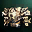 | [Imperial Crusader Breastplate](https://lineage.pmfun.com/item/6373/imperial-crusader-breastplate.html) | 193 | 205 | 1,072,500 AA |
| 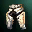 | [Imperial Crusader Gaiters](https://lineage.pmfun.com/item/6374/imperial-crusader-gaiters.html) | 121 | 128 | 672,000 AA |
| 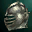 | [Imperial Crusader Helmet](https://lineage.pmfun.com/item/6378/imperial-crusader-helmet.html) | 83 | - | 402,750 AA |
| 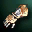 | [Imperial Crusader Gauntlets](https://lineage.pmfun.com/item/6375/imperial-crusader-gauntlets.html) | 55 | - | 268,500 AA |
| 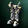 | [Imperial Crusader Boots](https://lineage.pmfun.com/item/6376/imperial-crusader-boots.html) | 55 | - | 268,500 AA |
|  | [Imperial Crusader Shield](https://lineage.pmfun.com/item/6377/imperial-crusader-shield.html) | 276 | 290 | 282,000 AA |

### Draconic Leather Light Armor Set
**Tipo:** Light Armor Set  

#### Bônus do Set / Modificações:
- Attack Speed/P. Atk +4%
- Maximum MP +289
- Weight Limit +5759
- [DEX +1](https://lineage.pmfun.com/list/set#DEX)
- [STR +1](https://lineage.pmfun.com/list/set#STR)
- [CON -2](https://lineage.pmfun.com/list/set#CON)

#### Partes do Set:
| Ícone | Parte | Sealed P.Def | Unsealed P.Def | Unseal Fee |
|:---:|:---|:---:|:---:|:---:|
| 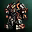 | [Draconic Leather Armor](https://lineage.pmfun.com/item/6379/draconic-leather-armor.html) | 236 | 249 | 1,305,000 AA |
| 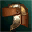 | [Draconic Leather Helmet](https://lineage.pmfun.com/item/6382/draconic-leather-helmet.html) | 93 | - | 402,750 AA |
| 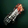 | [Draconic Leather Gloves](https://lineage.pmfun.com/item/6380/draconic-leather-gloves.html) | 55 | - | 268,500 AA |
|  | [Draconic Leather Boots](https://lineage.pmfun.com/item/6381/draconic-leather-boots.html) | 55 | - | 268,500 AA |

### Major Arcana Robe Set
**Tipo:** Robe Set  

#### Bônus do Set / Modificações:
- M. Atk +17%
- Movement Speed +7
- Casting Cancel Probability -50%
- Weight Limit +5759
- [WIT +1](https://lineage.pmfun.com/list/set#WIT)
- [INT +1](https://lineage.pmfun.com/list/set#INT)
- [MEN -2](https://lineage.pmfun.com/list/set#MEN)
- Stun resistance +50%

#### Partes do Set:
| Ícone | Parte | Sealed P.Def | Unsealed P.Def | Unseal Fee |
|:---:|:---|:---:|:---:|:---:|
| 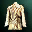 | [Major Arcana Robe](https://lineage.pmfun.com/item/6383/major-arcana-robe.html) | 157 | 166 + 866 MP | 1,305,000 AA |
|  | [Major Arcana Circlet](https://lineage.pmfun.com/item/6386/major-arcana-circlet.html) | 83 | - | 402,750 AA |
| 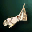 | [Major Arcana Gloves](https://lineage.pmfun.com/item/6384/major-arcana-gloves.html) | 55 | - | 268,500 AA |
| 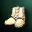 | [Major Arcana Boots](https://lineage.pmfun.com/item/6385/major-arcana-boots.html) | 55 | - | 268,500 AA |

### Tateossian Jewelry Set
**Tipo:** Jewelry Set  

#### Bônus do Set / Modificações:
- More Mdef
- More MP when unsealed

#### Partes do Set:
| Ícone | Parte | Sealed P.Def | Unsealed P.Def | Unseal Fee |
|:---:|:---|:---:|:---:|:---:|
| 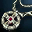 | [Tateossian Necklace](https://lineage.pmfun.com/item/920/tateossian-necklace.html) | 91 | 95 + 42 MP | 1,494,460 AA |
| 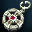 | [Tateossian Earring](https://lineage.pmfun.com/item/858/tateossian-earring.html) | 68 | 71 + 31 MP | 1,120,845 AA |
| 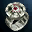 | [Tateossian Ring](https://lineage.pmfun.com/item/889/tateossian-ring.html) | 46 | 48 + 21 MP | 747,230 AA |

---
## A Grade 

### Majestic Heavy Set
**Tipo:** Heavy Armor Set  

#### Bônus do Set / Modificações:
- P. Atk. +4%
- Accuracy +3
- Stun Resistance +50%
- [STR +2](https://lineage.pmfun.com/list/set#STR)
- [Con -2](https://lineage.pmfun.com/list/set#CON)

#### Partes do Set:
| Ícone | Parte | Ícone Selado | Parte Selada (Sealed) |
|:---:|:---|:---:|:---|
| 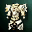 | [Majestic Plate Armor](https://lineage.pmfun.com/item/2383/majestic-plate-armor.html) | 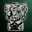 | [Sealed Majestic Plate Armor](https://lineage.pmfun.com/item/5316/sealed-majestic-plate-armor.html) |
| 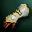 | [Majestic Gauntlets - Heavy Armor](https://lineage.pmfun.com/item/5774/majestic-gauntlets--heavy-armor.html) | 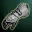 | [Sealed Majestic Gauntlets](https://lineage.pmfun.com/item/5318/sealed-majestic-gauntlets.html) |
| 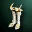 | [Majestic Boots - Heavy Armor](https://lineage.pmfun.com/item/5786/majestic-boots--heavy-armor.html) | 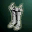 | [Sealed Majestic Boots](https://lineage.pmfun.com/item/5319/sealed-majestic-boots.html) |
|  | [Majestic Circlet](https://lineage.pmfun.com/item/2419/majestic-circlet.html) |  | [Sealed Majestic Circlet](https://lineage.pmfun.com/item/5317/sealed-majestic-circlet.html) |

### Nightmare Heavy Set
**Tipo:** Heavy Armor Set  

#### Bônus do Set / Modificações:
- P. Atk. +4%
- Sleep and Hold Resistance +70%
- [CON +2](https://lineage.pmfun.com/list/set#CON)
- [DEX -2](https://lineage.pmfun.com/list/set#DEX)
- With a shield of nightmare, 5% of the damage inflicted by the enemy will be reflected back upon him.

#### Partes do Set:
| Ícone | Parte | Ícone Selado | Parte Selada (Sealed) |
|:---:|:---|:---:|:---|
| 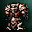 | [Armor Of Nightmare](https://lineage.pmfun.com/item/374/armor-of-nightmare.html) | 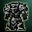 | [Sealed Armor Of Nightmare](https://lineage.pmfun.com/item/5311/sealed-armor-of-nightmare.html) |
| 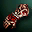 | [Gauntlets Of Nightmare - Heavy Armor](https://lineage.pmfun.com/item/5771/gauntlets-of-nightmare--heavy-armor.html) | 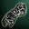 | [Sealed Gauntlets Of Nightmare](https://lineage.pmfun.com/item/5313/sealed-gauntlets-of-nightmare.html) |
|  | [Boots Of Nightmare - Heavy Armor](https://lineage.pmfun.com/item/5783/boots-of-nightmare--heavy-armor.html) | 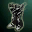 | [Sealed Boots Of Nightmare](https://lineage.pmfun.com/item/5314/sealed-boots-of-nightmare.html) |
|  | [Helm Of Nightmare](https://lineage.pmfun.com/item/2418/helm-of-nightmare.html) |  | [Sealed Helm Of Nightmare](https://lineage.pmfun.com/item/5312/sealed-helm-of-nightmare.html) |
| 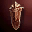 | [Shield Of Nightmare](https://lineage.pmfun.com/item/2498/shield-of-nightmare.html) | 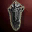 | [Sealed Shield Of Nightmare](https://lineage.pmfun.com/item/5315/sealed-shield-of-nightmare.html) |

### Tallum Heavy Set
**Tipo:** Heavy Armor Set  

#### Bônus do Set / Modificações:
- Atk. Spd. +8%
- Weight increased plus the point at which a weight penalty is applied +5759
- Poison and Bleed Resistance +80%
- [STR +2](https://lineage.pmfun.com/list/set#STR)
- [CON -2](https://lineage.pmfun.com/list/set#CON)

#### Partes do Set:
| Ícone | Parte | Ícone Selado | Parte Selada (Sealed) |
|:---:|:---|:---:|:---|
| 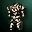 | [Tallum Plate Armor](https://lineage.pmfun.com/item/2382/tallum-plate-armor.html) | 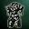 | [Sealed Tallum Plate Armor](https://lineage.pmfun.com/item/5293/sealed-tallum-plate-armor.html) |
| 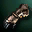 | [Tallum Gloves - Heavy Armor](https://lineage.pmfun.com/item/5768/tallum-gloves--heavy-armor.html) | 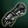 | [Sealed Tallum Gloves](https://lineage.pmfun.com/item/5295/sealed-tallum-gloves.html) |
| 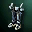 | [Tallum Boots - Heavy Armor](https://lineage.pmfun.com/item/5780/tallum-boots--heavy-armor.html) | 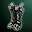 | [Sealed Tallum Boots](https://lineage.pmfun.com/item/5296/sealed-tallum-boots.html) |
|  | [Tallum Helm](https://lineage.pmfun.com/item/547/tallum-helm.html) | 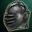 | [Sealed Tallum Helmet](https://lineage.pmfun.com/item/5294/sealed-tallum-helmet.html) |

### Dark Crystal Heavy Set
**Tipo:** Heavy Armor Set  

#### Bônus do Set / Modificações:
- Heal +4%
- Paralysis Resistance +50%
- [STR -2](https://lineage.pmfun.com/list/set#STR)
- [CON +2](https://lineage.pmfun.com/list/set#CON)
- With a Dark Crystal Shield, shield defense rate +18%

#### Partes do Set:
| Ícone | Parte | Ícone Selado | Parte Selada (Sealed) |
|:---:|:---|:---:|:---|
| 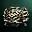 | [Dark Crystal Breastplate](https://lineage.pmfun.com/item/365/dark-crystal-breastplate.html) | 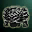 | [Sealed Dark Crystal Breastplate](https://lineage.pmfun.com/item/5287/sealed-dark-crystal-breastplate.html) |
| 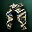 | [Dark Crystal Gaiters](https://lineage.pmfun.com/item/388/dark-crystal-gaiters.html) | 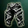 | [Sealed Dark Crystal Gaiters](https://lineage.pmfun.com/item/5288/sealed-dark-crystal-gaiters.html) |
| 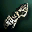 | [Dark Crystal Gloves - Heavy Armor](https://lineage.pmfun.com/item/5765/dark-crystal-gloves--heavy-armor.html) | 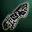 | [Sealed Dark Crystal Gloves](https://lineage.pmfun.com/item/5290/sealed-dark-crystal-gloves.html) |
| 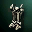 | [Dark Crystal Boots - Heavy Armor](https://lineage.pmfun.com/item/5777/dark-crystal-boots--heavy-armor.html) | 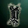 | [Sealed Dark Crystal Boots](https://lineage.pmfun.com/item/5291/sealed-dark-crystal-boots.html) |
|  | [Dark Crystal Helmet](https://lineage.pmfun.com/item/512/dark-crystal-helmet.html) |  | [Sealed Dark Crystal Helmet](https://lineage.pmfun.com/item/5289/sealed-dark-crystal-helmet.html) |
| 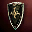 | [Dark Crystal Shield](https://lineage.pmfun.com/item/641/dark-crystal-shield.html) |  | [Sealed Dark Crystal Shield](https://lineage.pmfun.com/item/5292/sealed-dark-crystal-shield.html) |

### Majestic Light Set
**Tipo:** Light Armor Set  

#### Bônus do Set / Modificações:
- Archery P. Atk. +8%
- MP +240
- Weight increased plus the point at which a weight penalty is applied +5759
- Stun Resistance +50%
- [DEX +1](https://lineage.pmfun.com/list/set#DEX)
- [CON -1](https://lineage.pmfun.com/list/set#CON)

#### Partes do Set:
| Ícone | Parte | Ícone Selado | Parte Selada (Sealed) |
|:---:|:---|:---:|:---|
|  | [Majestic Leather Armor](https://lineage.pmfun.com/item/2395/majestic-leather-armor.html) | 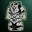 | [Sealed Majestic Leather Armor](https://lineage.pmfun.com/item/5323/sealed-majestic-leather-armor.html) |
| 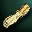 | [Majestic Gauntlets - Light Armor](https://lineage.pmfun.com/item/5775/majestic-gauntlets--light-armor.html) |  | [Sealed Majestic Gauntlets](https://lineage.pmfun.com/item/5318/sealed-majestic-gauntlets.html) |
| 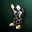 | [Majestic Boots - Light Armor](https://lineage.pmfun.com/item/5787/majestic-boots--light-armor.html) |  | [Sealed Majestic Boots](https://lineage.pmfun.com/item/5319/sealed-majestic-boots.html) |
|  | [Majestic Circlet](https://lineage.pmfun.com/item/2419/majestic-circlet.html) |  | [Sealed Majestic Circlet](https://lineage.pmfun.com/item/5317/sealed-majestic-circlet.html) |

### Nightmare Light Set
**Tipo:** Light Armor Set  

#### Bônus do Set / Modificações:
- M. Def. +4%
- Sleep and Hold Resistance +70%
- Restores 3% of melee damage inflicted on the enemy to oneself
- [DEX +1](https://lineage.pmfun.com/list/set#DEX)
- [CON -1](https://lineage.pmfun.com/list/set#CON)

#### Partes do Set:
| Ícone | Parte | Ícone Selado | Parte Selada (Sealed) |
|:---:|:---|:---:|:---|
|  | [Nightmarish Leather Armor](https://lineage.pmfun.com/item/2394/nightmarish-leather-armor.html) | 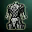 | [Sealed Leather Armor Of Nightmare](https://lineage.pmfun.com/item/5320/sealed-leather-armor-of-nightmare.html) |
| 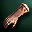 | [Gloves of Nightmare - Light Armor](https://lineage.pmfun.com/item/5772/gauntlets-of-nightmare--light-armor.html) |  | [Sealed Gloves of Nightmare](https://lineage.pmfun.com/item/5313/sealed-gauntlets-of-nightmare.html) |
| 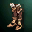 | [Boots Of Nightmare - Light Armor](https://lineage.pmfun.com/item/5784/boots-of-nightmare--light-armor.html) |  | [Sealed Boots Of Nightmare](https://lineage.pmfun.com/item/5314/sealed-boots-of-nightmare.html) |
|  | [Helm Of Nightmare](https://lineage.pmfun.com/item/2418/helm-of-nightmare.html) |  | [Sealed Helm Of Nightmare](https://lineage.pmfun.com/item/5312/sealed-helm-of-nightmare.html) |

### Tallum Light Set
**Tipo:** Light Armor Set  

#### Bônus do Set / Modificações:
- MP Regeneration +8%
- MP +222
- Poison and Bleed Resistance +80%
- [MEN +2](https://lineage.pmfun.com/list/set#MEN)
- [WIT -2](https://lineage.pmfun.com/list/set#WIT)

#### Partes do Set:
| Ícone | Parte | Ícone Selado | Parte Selada (Sealed) |
|:---:|:---|:---:|:---|
| 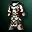 | [Tallum Leather Armor](https://lineage.pmfun.com/item/2393/tallum-leather-armor.html) |  | [Sealed Tallum Leather Armor](https://lineage.pmfun.com/item/5301/sealed-tallum-leather-armor.html) |
|  | [Tallum Gloves - Light Armor](https://lineage.pmfun.com/item/5769/tallum-gloves--light-armor.html) |  | [Sealed Tallum Gloves](https://lineage.pmfun.com/item/5295/sealed-tallum-gloves.html) |
|  | [Tallum Boots - Light Armor](https://lineage.pmfun.com/item/5781/tallum-boots--light-armor.html) |  | [Sealed Tallum Boots](https://lineage.pmfun.com/item/5296/sealed-tallum-boots.html) |
|  | [Tallum Helm](https://lineage.pmfun.com/item/547/tallum-helm.html) |  | [Sealed Tallum Helmet](https://lineage.pmfun.com/item/5294/sealed-tallum-helmet.html) |

### Dark Crystal Light Set
**Tipo:** Light Armor Set  

#### Bônus do Set / Modificações:
- Atk. Spd. +4%
- P. Atk. +4%
- Paralysis Resistance +50%
- [STR +1](https://lineage.pmfun.com/list/set#STR)
- [CON -1](https://lineage.pmfun.com/list/set#CON)

#### Partes do Set:
| Ícone | Parte | Ícone Selado | Parte Selada (Sealed) |
|:---:|:---|:---:|:---|
|  | [Dark Crystal Leather Armor](https://lineage.pmfun.com/item/2385/dark-crystal-leather-armor.html) |  | [Sealed Dark Crystal Leather Armor](https://lineage.pmfun.com/item/5297/sealed-dark-crystal-leather-armor.html) |
|  | [Dark Crystal Leggings](https://lineage.pmfun.com/item/2389/dark-crystal-leggings.html) |  | [Sealed Dark Crystal Leggings](https://lineage.pmfun.com/item/5298/sealed-dark-crystal-leggings.html) |
|  | [Dark Crystal Gloves - Light Armor](https://lineage.pmfun.com/item/5766/dark-crystal-gloves--light-armor.html) |  | [Sealed Dark Crystal Gloves](https://lineage.pmfun.com/item/5290/sealed-dark-crystal-gloves.html) |
|  | [Dark Crystal Boots - Light Armor](https://lineage.pmfun.com/item/5778/dark-crystal-boots--light-armor.html) |  | [Sealed Dark Crystal Boots](https://lineage.pmfun.com/item/5291/sealed-dark-crystal-boots.html) |
|  | [Dark Crystal Helmet](https://lineage.pmfun.com/item/512/dark-crystal-helmet.html) |  | [Sealed Dark Crystal Helmet](https://lineage.pmfun.com/item/5289/sealed-dark-crystal-helmet.html) |

### Majestic Robe Set
**Tipo:** Robe Set  

#### Bônus do Set / Modificações:
- MP +240
- Casting Spd. +15%
- MP Regeneration +8%
- Stun Resistance +50%
- [MEN +1](https://lineage.pmfun.com/list/set#MEN)
- [INT -1](https://lineage.pmfun.com/list/set#INT)

#### Partes do Set:
| Ícone | Parte | Ícone Selado | Parte Selada (Sealed) |
|:---:|:---|:---:|:---|
|  | [Majestic Robe](https://lineage.pmfun.com/item/2409/majestic-robe.html) |  | [Sealed Majestic Robe](https://lineage.pmfun.com/item/5329/sealed-majestic-robe.html) |
|  | [Majestic Gloves - Robe](https://lineage.pmfun.com/item/5776/majestic-gauntlets--robe.html) |  | [Sealed Majestic Gloves](https://lineage.pmfun.com/item/5318/sealed-majestic-gauntlets.html) |
|  | [Majestic Boots - Robe](https://lineage.pmfun.com/item/5788/majestic-boots--robe.html) |  | [Sealed Majestic Boots](https://lineage.pmfun.com/item/5319/sealed-majestic-boots.html) |
|  | [Majestic Circlet](https://lineage.pmfun.com/item/2419/majestic-circlet.html) |  | [Sealed Majestic Circlet](https://lineage.pmfun.com/item/5317/sealed-majestic-circlet.html) |

### Nightmare Robe Set
**Tipo:** Robe Set  

#### Bônus do Set / Modificações:
- MP Regeneration +4%
- M. Atk. +8%
- Sleep and Hold Resistance +70%
- [INT +2](https://lineage.pmfun.com/list/set#INT)
- [WIT -2](https://lineage.pmfun.com/list/set#WIT)

#### Partes do Set:
| Ícone | Parte | Ícone Selado | Parte Selada (Sealed) |
|:---:|:---|:---:|:---|
|  | [Nightmare Robe](https://lineage.pmfun.com/item/2408/nightmare-robe.html) |  | [Sealed Nightmare Robe](https://lineage.pmfun.com/item/5326/sealed-nightmare-robe.html) |
|  | [Gloves Of Nightmare - Robe](https://lineage.pmfun.com/item/5773/gauntlets-of-nightmare--robe.html) |  | [Sealed Gloves Of Nightmare](https://lineage.pmfun.com/item/5313/sealed-gauntlets-of-nightmare.html) |
|  | [Boots Of Nightmare - Robe](https://lineage.pmfun.com/item/5785/boots-of-nightmare--robe.html) |  | [Sealed Boots Of Nightmare](https://lineage.pmfun.com/item/5314/sealed-boots-of-nightmare.html) |
|  | [Helm Of Nightmare](https://lineage.pmfun.com/item/2418/helm-of-nightmare.html) |  | [Sealed Helm Of Nightmare](https://lineage.pmfun.com/item/5312/sealed-helm-of-nightmare.html) |

### Tallum Robe Set
**Tipo:** Robe Set  

#### Bônus do Set / Modificações:
- Casting Spd. +15%
- M. Def. +8%
- Poison and Bleed Resistance +80%
- [INT -2](https://lineage.pmfun.com/list/set#INT)
- [WIT +2](https://lineage.pmfun.com/list/set#WIT)

#### Partes do Set:
| Ícone | Parte | Ícone Selado | Parte Selada (Sealed) |
|:---:|:---|:---:|:---|
|  | [Tallum Tunic](https://lineage.pmfun.com/item/2400/tallum-tunic.html) |  | [Sealed Tallum Tunic](https://lineage.pmfun.com/item/5304/sealed-tallum-tunic.html) |
|  | [Tallum Stockings](https://lineage.pmfun.com/item/2405/tallum-stockings.html) |  | [Sealed Tallum Stockings](https://lineage.pmfun.com/item/5305/sealed-tallum-stockings.html) |
|  | [Tallum Gloves - Robe](https://lineage.pmfun.com/item/5770/tallum-gloves--robe.html) |  | [Sealed Tallum Gloves](https://lineage.pmfun.com/item/5295/sealed-tallum-gloves.html) |
|  | [Tallum Boots - Robe](https://lineage.pmfun.com/item/5782/tallum-boots--robe.html) |  | [Sealed Tallum Boots](https://lineage.pmfun.com/item/5296/sealed-tallum-boots.html) |
|  | [Tallum Helm](https://lineage.pmfun.com/item/547/tallum-helm.html) |  | [Sealed Tallum Helmet](https://lineage.pmfun.com/item/5294/sealed-tallum-helmet.html) |

### Dark Crystal Robe Set
**Tipo:** Robe Set  

#### Bônus do Set / Modificações:
- P. Def. +8%
- Casting Spd. +15%
- Speed +7
- Small decrease in chance of spell interruption
- Paralysis Resistance +50%
- [WIT +2](https://lineage.pmfun.com/list/set#WIT)
- [MEN -2](https://lineage.pmfun.com/list/set#MEN)

#### Partes do Set:
| Ícone | Parte | Ícone Selado | Parte Selada (Sealed) |
|:---:|:---|:---:|:---|
|  | [Dark Crystal Robe](https://lineage.pmfun.com/item/2407/dark-crystal-robe.html) |  | [Sealed Dark Crystal Robe](https://lineage.pmfun.com/item/5308/sealed-dark-crystal-robe.html) |
|  | [Dark Crystal Gloves - Robe](https://lineage.pmfun.com/item/5767/dark-crystal-gloves--robe.html) |  | [Sealed Dark Crystal Gloves](https://lineage.pmfun.com/item/5290/sealed-dark-crystal-gloves.html) |
|  | [Dark Crystal Boots - Robe](https://lineage.pmfun.com/item/5779/dark-crystal-boots--robe.html) |  | [Sealed Dark Crystal Boots](https://lineage.pmfun.com/item/5291/sealed-dark-crystal-boots.html) |
|  | [Dark Crystal Helmet](https://lineage.pmfun.com/item/512/dark-crystal-helmet.html) |  | [Sealed Dark Crystal Helmet](https://lineage.pmfun.com/item/5289/sealed-dark-crystal-helmet.html) |

---
## B Grade 

### Heavy Zubei Set
**Tipo:** Heavy armor  

#### Bônus do Set / Modificações:
- + 5.24 % Pdef
- + 294 HP

#### Partes do Set:
| Ícone | Parte | Link |
|:---:|:---|:---|
|  | **Zubei's Breastplate** | [Ver detalhes no PMfun](https://lineage.pmfun.com/item/357/zubeis-breastplate.html) |
|  | **Zubei's Gaiters** | [Ver detalhes no PMfun](https://lineage.pmfun.com/item/383/zubeis-gaiters.html) |
|  | **Zubei's Gauntlets** | [Ver detalhes no PMfun](https://lineage.pmfun.com/item/612/zubeis-gauntlets.html) |
|  | **Zubei's Boots** | [Ver detalhes no PMfun](https://lineage.pmfun.com/item/554/zubeis-boots.html) |
|  | **Zubei's Helmet** | [Ver detalhes no PMfun](https://lineage.pmfun.com/item/503/zubeis-helmet.html) |

### Heavy Avadon Set
**Tipo:** Heavy armor  

#### Bônus do Set / Modificações:
- +294 HP
- with Shield +24% shield defense rate

#### Partes do Set:
| Ícone | Parte | Link |
|:---:|:---|:---|
|  | **Avadon Breastplate** | [Ver detalhes no PMfun](https://lineage.pmfun.com/item/2376/avadon-breastplate.html) |
|  | **Avadon Gaiters** | [Ver detalhes no PMfun](https://lineage.pmfun.com/item/2379/avadon-gaiters.html) |
|  | **Avadon Gloves** | [Ver detalhes no PMfun](https://lineage.pmfun.com/item/2464/avadon-gloves.html) |
|  | **Avadon Boots** | [Ver detalhes no PMfun](https://lineage.pmfun.com/item/600/avadon-boots.html) |
|  | **Avadon Circlet** | [Ver detalhes no PMfun](https://lineage.pmfun.com/item/2415/avadon-circlet.html) |
|  | **Avadon Shield** | [Ver detalhes no PMfun](https://lineage.pmfun.com/item/673/avadon-shield.html) |

### Heavy Blue Wolf Set
**Tipo:** Heavy armor  

#### Bônus do Set / Modificações:
- Speed +7
- HP Regeneration +5.24%
- [STR +3](https://lineage.pmfun.com/list/set#STR)
- [CON -1](https://lineage.pmfun.com/list/set#CON)
- [DEX -2](https://lineage.pmfun.com/list/set#DEX)

#### Partes do Set:
| Ícone | Parte | Link |
|:---:|:---|:---|
|  | **Blue Wolf Breastplate** | [Ver detalhes no PMfun](https://lineage.pmfun.com/item/358/blue-wolf-breastplate.html) |
|  | **Blue Wolf Gaiters** | [Ver detalhes no PMfun](https://lineage.pmfun.com/item/2380/blue-wolf-gaiters.html) |
|  | **Blue Wolf Gloves** | [Ver detalhes no PMfun](https://lineage.pmfun.com/item/2487/blue-wolf-gloves.html) |
|  | **Blue Wolf Boots** | [Ver detalhes no PMfun](https://lineage.pmfun.com/item/2439/blue-wolf-boots.html) |
|  | **Blue Wolf Helmet** | [Ver detalhes no PMfun](https://lineage.pmfun.com/item/2416/blue-wolf-helmet.html) |

### Heavy Doom Set
**Tipo:** Heavy armor  

#### Bônus do Set / Modificações:
- HP +320
- Breath Gauge increased
- [STR -3](https://lineage.pmfun.com/list/set#STR)
- [CON +3](https://lineage.pmfun.com/list/set#CON)
- With a Doom Shield, shield defense rate +24%

#### Partes do Set:
| Ícone | Parte | Link |
|:---:|:---|:---|
|  | **Doom Plate Armor** | [Ver detalhes no PMfun](https://lineage.pmfun.com/item/2381/doom-plate-armor.html) |
|  | **Doom Gloves** | [Ver detalhes no PMfun](https://lineage.pmfun.com/item/2475/doom-gloves.html) |
|  | **Boots Of Doom** | [Ver detalhes no PMfun](https://lineage.pmfun.com/item/601/boots-of-doom.html) |
|  | **Doom Helmet** | [Ver detalhes no PMfun](https://lineage.pmfun.com/item/2417/doom-helmet.html) |
|  | **Doom Shield** | [Ver detalhes no PMfun](https://lineage.pmfun.com/item/110/doom-shield.html) |

### Light Zubei Set
**Tipo:** Light Armor  

#### Bônus do Set / Modificações:
- +4 Evasion

#### Partes do Set:
| Ícone | Parte | Link |
|:---:|:---|:---|
|  | **Zubei's Leather Shirt** | [Ver detalhes no PMfun](https://lineage.pmfun.com/item/2384/zubeis-leather-shirt.html) |
|  | **Zubei's Leather Gaiters** | [Ver detalhes no PMfun](https://lineage.pmfun.com/item/2388/zubeis-leather-gaiters.html) |
|  | **Zubei's Gauntlets** | [Ver detalhes no PMfun](https://lineage.pmfun.com/item/612/zubeis-gauntlets.html) |
|  | **Zubei's Boots** | [Ver detalhes no PMfun](https://lineage.pmfun.com/item/554/zubeis-boots.html) |
|  | **Zubei's Helmet** | [Ver detalhes no PMfun](https://lineage.pmfun.com/item/503/zubeis-helmet.html) |

### Light Avadon Set
**Tipo:** Light Armor  

#### Bônus do Set / Modificações:
- M. Def. +5.25%
- Point at which a weight penalty is applied +5795

#### Partes do Set:
| Ícone | Parte | Link |
|:---:|:---|:---|
|  | **Avadon Leather Armor** | [Ver detalhes no PMfun](https://lineage.pmfun.com/item/2390/avadon-leather-armor.html) |
|  | **Avadon Gloves** | [Ver detalhes no PMfun](https://lineage.pmfun.com/item/2464/avadon-gloves.html) |
|  | **Avadon Boots** | [Ver detalhes no PMfun](https://lineage.pmfun.com/item/600/avadon-boots.html) |
|  | **Avadon Circlet** | [Ver detalhes no PMfun](https://lineage.pmfun.com/item/2415/avadon-circlet.html) |

### Light Blue Wolf Set
**Tipo:** Light Armor  

#### Bônus do Set / Modificações:
- P. Def. +5.24%
- Casting Spd. +15%
- [INT -2](https://lineage.pmfun.com/list/set#INT)
- [MEN +3](https://lineage.pmfun.com/list/set#MEN)
- [WIT -1](https://lineage.pmfun.com/list/set#WIT)

#### Partes do Set:
| Ícone | Parte | Link |
|:---:|:---|:---|
|  | **Blue Wolf Leather Armor** | [Ver detalhes no PMfun](https://lineage.pmfun.com/item/2391/blue-wolf-leather-armor.html) |
|  | **Blue Wolf Gloves** | [Ver detalhes no PMfun](https://lineage.pmfun.com/item/2487/blue-wolf-gloves.html) |
|  | **Blue Wolf Boots** | [Ver detalhes no PMfun](https://lineage.pmfun.com/item/2439/blue-wolf-boots.html) |
|  | **Blue Wolf Helmet** | [Ver detalhes no PMfun](https://lineage.pmfun.com/item/2416/blue-wolf-helmet.html) |

### Light Doom Set
**Tipo:** Light Armor  

#### Bônus do Set / Modificações:
- Breath Gauge increased
- P. Atk. +2.7%
- MP Regeneration +2.5%
- [STR -1](https://lineage.pmfun.com/list/set#STR)[CON -2](https://lineage.pmfun.com/list/set#CON)
- [DEX +3](https://lineage.pmfun.com/list/set#DEX)Poision Resistance +20%

#### Partes do Set:
| Ícone | Parte | Link |
|:---:|:---|:---|
|  | **Leather Armor Of Doom** | [Ver detalhes no PMfun](https://lineage.pmfun.com/item/2392/leather-armor-of-doom.html) |
|  | **Doom Gloves** | [Ver detalhes no PMfun](https://lineage.pmfun.com/item/2475/doom-gloves.html) |
|  | **Boots Of Doom** | [Ver detalhes no PMfun](https://lineage.pmfun.com/item/601/boots-of-doom.html) |
|  | **Doom Helmet** | [Ver detalhes no PMfun](https://lineage.pmfun.com/item/2417/doom-helmet.html) |

### Zubei Robe Set
**Tipo:** Robe Armor  

#### Bônus do Set / Modificações:
- M. Atk. +10%
- MP Regeneration -5%

#### Partes do Set:
| Ícone | Parte | Link |
|:---:|:---|:---|
|  | **Tunic Of Zubei** | [Ver detalhes no PMfun](https://lineage.pmfun.com/item/2397/tunic-of-zubei.html) |
|  | **Stockings Of Zubei** | [Ver detalhes no PMfun](https://lineage.pmfun.com/item/2402/stockings-of-zubei.html) |
|  | **Zubei's Gauntlets** | [Ver detalhes no PMfun](https://lineage.pmfun.com/item/612/zubeis-gauntlets.html) |
|  | **Zubei's Boots** | [Ver detalhes no PMfun](https://lineage.pmfun.com/item/554/zubeis-boots.html) |
|  | **Zubei's Helmet** | [Ver detalhes no PMfun](https://lineage.pmfun.com/item/503/zubeis-helmet.html) |

### Avadon Robe Set
**Tipo:** Robe  

#### Bônus do Set / Modificações:
- P. Def. +5.247%
- Casting Spd. +15%

#### Partes do Set:
| Ícone | Parte | Link |
|:---:|:---|:---|
|  | **Avadon Robe** | [Ver detalhes no PMfun](https://lineage.pmfun.com/item/2406/avadon-robe.html) |
|  | **Avadon Gloves** | [Ver detalhes no PMfun](https://lineage.pmfun.com/item/2464/avadon-gloves.html) |
|  | **Avadon Boots** | [Ver detalhes no PMfun](https://lineage.pmfun.com/item/600/avadon-boots.html) |
|  | **Avadon Circlet** | [Ver detalhes no PMfun](https://lineage.pmfun.com/item/2415/avadon-circlet.html) |

### Blue Wolf Robe Set
**Tipo:** Robe Armor  

#### Bônus do Set / Modificações:
- MP +206
- MP Regeneration +5.24%
- [INT -2](https://lineage.pmfun.com/list/set#INT)
- [MEN -1](https://lineage.pmfun.com/list/set#MEN)
- [WIT +3](https://lineage.pmfun.com/list/set#WIT)

#### Partes do Set:
| Ícone | Parte | Link |
|:---:|:---|:---|
|  | **Blue Wolf Tunic** | [Ver detalhes no PMfun](https://lineage.pmfun.com/item/2398/blue-wolf-tunic.html) |
|  | **Blue Wolf Stockings** | [Ver detalhes no PMfun](https://lineage.pmfun.com/item/2403/blue-wolf-stockings.html) |
|  | **Blue Wolf Gloves** | [Ver detalhes no PMfun](https://lineage.pmfun.com/item/2487/blue-wolf-gloves.html) |
|  | **Blue Wolf Boots** | [Ver detalhes no PMfun](https://lineage.pmfun.com/item/2439/blue-wolf-boots.html) |
|  | **Blue Wolf Helmet** | [Ver detalhes no PMfun](https://lineage.pmfun.com/item/2416/blue-wolf-helmet.html) |

### Doom Robe Set
**Tipo:** Robe  

#### Bônus do Set / Modificações:
- Speed + 7
- Breath Gauge increased
- MP Regeneration +5.24%
- [INT +2](https://lineage.pmfun.com/list/set#INT)
- [MEN +1](https://lineage.pmfun.com/list/set#MEN)
- [WIT -3](https://lineage.pmfun.com/list/set#WIT)

#### Partes do Set:
| Ícone | Parte | Link |
|:---:|:---|:---|
|  | **Tunic Of Doom** | [Ver detalhes no PMfun](https://lineage.pmfun.com/item/2399/tunic-of-doom.html) |
|  | **Stockings Of Doom** | [Ver detalhes no PMfun](https://lineage.pmfun.com/item/2404/stockings-of-doom.html) |
|  | **Doom Gloves** | [Ver detalhes no PMfun](https://lineage.pmfun.com/item/2475/doom-gloves.html) |
|  | **Boots Of Doom** | [Ver detalhes no PMfun](https://lineage.pmfun.com/item/601/boots-of-doom.html) |
|  | **Doom Helmet** | [Ver detalhes no PMfun](https://lineage.pmfun.com/item/2417/doom-helmet.html) |

---
## C Grade 

### Chain Mail Set
**Tipo:** Heavy armor  
**Defesa Física do Set:** 242 | **Bônus de MP:** 0  

#### Bônus do Set / Modificações:
- +5.24 % to Dagger Defense
- with Shiled +198 HP

#### Partes do Set:
| Ícone | Parte | Link |
|:---:|:---|:---|
|  | **Chain Mail Shirt** | [Ver detalhes no PMfun](https://lineage.pmfun.com/item/354/chain-mail-shirt.html) |
|  | **Chain Gaiters** | [Ver detalhes no PMfun](https://lineage.pmfun.com/item/381/chain-gaiters.html) |
|  | **Chain Hood** | [Ver detalhes no PMfun](https://lineage.pmfun.com/item/2413/chain-hood.html) |
|  | **Chain Shield** | [Ver detalhes no PMfun](https://lineage.pmfun.com/item/2495/chain-shield.html) |

### Composite Set
**Tipo:** Heavy armor  
**Defesa Física do Set:** 278 | **Bônus de MP:** 0  

#### Bônus do Set / Modificações:
- Point at which a weight penalty is applied +5795
- With a Composite Shield, M. Def. +5.26%

#### Partes do Set:
| Ícone | Parte | Link |
|:---:|:---|:---|
|  | **Composite Armor** | [Ver detalhes no PMfun](https://lineage.pmfun.com/item/60/composite-armor.html) |
|  | **Composite Helmet** | [Ver detalhes no PMfun](https://lineage.pmfun.com/item/517/composite-helmet.html) |
|  | **Composite Shield** | [Ver detalhes no PMfun](https://lineage.pmfun.com/item/107/composite-shield.html) |

### Full Plate Set
**Tipo:** Heavy armor  
**Defesa Física do Set:** 297 | **Bônus de MP:** 0  

#### Bônus do Set / Modificações:
- HP +270
- With a Full Plate Shield, shield defense rate +5.24%

#### Partes do Set:
| Ícone | Parte | Link |
|:---:|:---|:---|
|  | **Full Plate Armor** | [Ver detalhes no PMfun](https://lineage.pmfun.com/item/356/full-plate-armor.html) |
|  | **Full Plate Helmet** | [Ver detalhes no PMfun](https://lineage.pmfun.com/item/2414/full-plate-helmet.html) |
|  | **Full Plate Shield** | [Ver detalhes no PMfun](https://lineage.pmfun.com/item/2497/full-plate-shield.html) |

### Tempered Mithril Set
**Tipo:** Light Armor  
**Defesa Física do Set:** 170 | **Bônus de MP:** 0  

#### Bônus do Set / Modificações:
- Evasion +4

#### Partes do Set:
| Ícone | Parte | Link |
|:---:|:---|:---|
|  | **Mithril Shirt** | [Ver detalhes no PMfun](https://lineage.pmfun.com/item/397/mithril-shirt.html) |
|  | **Tempered Mithril Gaiters** | [Ver detalhes no PMfun](https://lineage.pmfun.com/item/2387/tempered-mithril-gaiters.html) |
|  | **Mithril Boots** | [Ver detalhes no PMfun](https://lineage.pmfun.com/item/62/mithril-boots.html) |

### Plated Leather Set
**Tipo:** Light Armor  
**Defesa Física do Set:** 185 | **Bônus de MP:** 0  

#### Bônus do Set / Modificações:
- [+ 4 STR](https://lineage.pmfun.com/list/set#STR)
- [- 1 CON](https://lineage.pmfun.com/list/set#CON)

#### Partes do Set:
| Ícone | Parte | Link |
|:---:|:---|:---|
|  | **Plated Leather** | [Ver detalhes no PMfun](https://lineage.pmfun.com/item/398/plated-leather.html) |
|  | **Plated Leather Gaiters** | [Ver detalhes no PMfun](https://lineage.pmfun.com/item/418/plated-leather-gaiters.html) |
|  | **Plated Leather Boots** | [Ver detalhes no PMfun](https://lineage.pmfun.com/item/2431/plated-leather-boots.html) |

### Theca Leather Set
**Tipo:** Light Armor  
**Defesa Física do Set:** 209 | **Bônus de MP:** 0  

#### Bônus do Set / Modificações:
- P. Def. +5.24%

#### Partes do Set:
| Ícone | Parte | Link |
|:---:|:---|:---|
|  | **Theca Leather Armor** | [Ver detalhes no PMfun](https://lineage.pmfun.com/item/400/theca-leather-armor.html) |
|  | **Theca Leather Gaiters** | [Ver detalhes no PMfun](https://lineage.pmfun.com/item/420/theca-leather-gaiters.html) |
|  | **Theca Leather Boots** | [Ver detalhes no PMfun](https://lineage.pmfun.com/item/2436/theca-leather-boots.html) |

### Drake Leather Set
**Tipo:** Light Armor  
**Defesa Física do Set:** 218 | **Bônus de MP:** 0  

#### Bônus do Set / Modificações:
- +5.24% Mdef

#### Partes do Set:
| Ícone | Parte | Link |
|:---:|:---|:---|
|  | **Drake Leather Armor** | [Ver detalhes no PMfun](https://lineage.pmfun.com/item/401/drake-leather-armor.html) |
|  | **Drake Leather Boots** | [Ver detalhes no PMfun](https://lineage.pmfun.com/item/2437/drake-leather-boots.html) |

### Karmian Set
**Tipo:** Robe  
**Defesa Física do Set:** 129 | **Bônus de MP:** 366  

#### Bônus do Set / Modificações:
- + 5.24% Pdef
- + 15% Casting Speed

#### Partes do Set:
| Ícone | Parte | Link |
|:---:|:---|:---|
|  | **Karmian Tunic** | [Ver detalhes no PMfun](https://lineage.pmfun.com/item/439/karmian-tunic.html) |
|  | **Karmian Stockings** | [Ver detalhes no PMfun](https://lineage.pmfun.com/item/471/karmian-stockings.html) |
|  | **Karmian Gloves** | [Ver detalhes no PMfun](https://lineage.pmfun.com/item/2454/karmian-gloves.html) |

### Demon Set
**Tipo:** Robe  
**Defesa Física do Set:** 148 | **Bônus de MP:** 461  

#### Bônus do Set / Modificações:
- - 270 HP
- [+ 4 INT](https://lineage.pmfun.com/list/set#INT)
- [-1 WIT](https://lineage.pmfun.com/list/set#WIT)

#### Partes do Set:
| Ícone | Parte | Link |
|:---:|:---|:---|
|  | **Demon's Tunic** | [Ver detalhes no PMfun](https://lineage.pmfun.com/item/441/demons-tunic.html) |
|  | **Demon's Stockings** | [Ver detalhes no PMfun](https://lineage.pmfun.com/item/472/demons-stockings.html) |
|  | **Demon's Gloves** | [Ver detalhes no PMfun](https://lineage.pmfun.com/item/2459/demons-gloves.html) |

### Divine Set
**Tipo:** Robe  
**Defesa Física do Set:** 159 | **Bônus de MP:** 510  

#### Bônus do Set / Modificações:
- +5.24% Pdef
- +170 MP
- [-1 INT](https://lineage.pmfun.com/list/set#INT)
- [+1 WIT](https://lineage.pmfun.com/list/set#WIT)

#### Partes do Set:
| Ícone | Parte | Link |
|:---:|:---|:---|
|  | **Divine Tunic** | [Ver detalhes no PMfun](https://lineage.pmfun.com/item/442/divine-tunic.html) |
|  | **Divine Stockings** | [Ver detalhes no PMfun](https://lineage.pmfun.com/item/473/divine-stockings.html) |
|  | **Divine Gloves** | [Ver detalhes no PMfun](https://lineage.pmfun.com/item/2463/divine-gloves.html) |

---
## D Grade 

### Mithril Set
**Tipo:** Heavy armor  
**Defesa Física do Set:** 193 | **Bônus de MP:** 0  

#### Bônus do Set / Modificações:
- +20 Poison Resistance
- with Shield +126 HP

#### Partes do Set:
| Ícone | Parte | Link |
|:---:|:---|:---|
|  | **Mithril Breastplate** | [Ver detalhes no PMfun](https://lineage.pmfun.com/item/58/mithril-breastplate.html) |
|  | **Mithril Gaiters** | [Ver detalhes no PMfun](https://lineage.pmfun.com/item/59/mithril-gaiters.html) |
|  | **Helmet** | [Ver detalhes no PMfun](https://lineage.pmfun.com/item/47/helmet.html) |
|  | **Hoplon** | [Ver detalhes no PMfun](https://lineage.pmfun.com/item/628/hoplon.html) |

### Brigandine Set
**Tipo:** Heavy armor  
**Defesa Física do Set:** 217 | **Bônus de MP:** 0  

#### Bônus do Set / Modificações:
- +153 HP
- +5% Pdef
- with Shield +20 HP

#### Partes do Set:
| Ícone | Parte | Link |
|:---:|:---|:---|
|  | **Brigandine Tunic** | [Ver detalhes no PMfun](https://lineage.pmfun.com/item/352/brigandine-tunic.html) |
|  | **Brigandine Gaiters** | [Ver detalhes no PMfun](https://lineage.pmfun.com/item/2378/brigandine-gaiters.html) |
|  | **Brigandine Helmet** | [Ver detalhes no PMfun](https://lineage.pmfun.com/item/2411/brigandine-helmet.html) |
|  | **Brigandine Shield** | [Ver detalhes no PMfun](https://lineage.pmfun.com/item/2493/brigandine-shield.html) |

### Reinforced Leather Set
**Tipo:** Light Armor  
**Defesa Física do Set:** 143 | **Bônus de MP:** 0  

#### Bônus do Set / Modificações:
- MP +80

#### Partes do Set:
| Ícone | Parte | Link |
|:---:|:---|:---|
|  | **Reinforced Leather Shirt** | [Ver detalhes no PMfun](https://lineage.pmfun.com/item/394/reinforced-leather-shirt.html) |
|  | **Reinforced Leather Gaiters** | [Ver detalhes no PMfun](https://lineage.pmfun.com/item/416/reinforced-leather-gaiters.html) |
|  | **Reinforced Leather Boots** | [Ver detalhes no PMfun](https://lineage.pmfun.com/item/2422/reinforced-leather-boots.html) |

### Manticore Set
**Tipo:** Light Armor  
**Defesa Física do Set:** 159 | **Bônus de MP:** 0  

#### Bônus do Set / Modificações:
- MP +92

#### Partes do Set:
| Ícone | Parte | Link |
|:---:|:---|:---|
|  | **Manticore Skin Shirt** | [Ver detalhes no PMfun](https://lineage.pmfun.com/item/395/manticore-skin-shirt.html) |
|  | **Manticore Skin Gaiters** | [Ver detalhes no PMfun](https://lineage.pmfun.com/item/417/manticore-skin-gaiters.html) |
|  | **Manticore Skin Boots** | [Ver detalhes no PMfun](https://lineage.pmfun.com/item/2424/manticore-skin-boots.html) |

### Knowledge Set
**Tipo:** Robe  
**Defesa Física do Set:** 103 | **Bônus de MP:** 239  

#### Bônus do Set / Modificações:
- +10% Matk
- -5% MP Regeneration

#### Partes do Set:
| Ícone | Parte | Link |
|:---:|:---|:---|
|  | **Tunic Of Knowledge** | [Ver detalhes no PMfun](https://lineage.pmfun.com/item/436/tunic-of-knowledge.html) |
|  | **Stockings Of Knowledge** | [Ver detalhes no PMfun](https://lineage.pmfun.com/item/469/stockings-of-knowledge.html) |
|  | **Gloves Of Knowledge** | [Ver detalhes no PMfun](https://lineage.pmfun.com/item/2447/gloves-of-knowledge.html) |

### Elven Mithril Set
**Tipo:** Robe  
**Defesa Física do Set:** 115 | **Bônus de MP:** 274  

#### Bônus do Set / Modificações:
- +7 Speed
- -1 [INT](https://lineage.pmfun.com/list/set#INT)
- +1 [WIT](https://lineage.pmfun.com/list/set#WIT)

#### Partes do Set:
| Ícone | Parte | Link |
|:---:|:---|:---|
|  | **Mithril Tunic** | [Ver detalhes no PMfun](https://lineage.pmfun.com/item/437/mithril-tunic.html) |
|  | **Mithril Stockings** | [Ver detalhes no PMfun](https://lineage.pmfun.com/item/470/mithril-stockings.html) |
|  | **Elven Mithril Gloves** | [Ver detalhes no PMfun](https://lineage.pmfun.com/item/2450/elven-mithril-gloves.html) |

---
## No Grade 

### Wooden Set
**Tipo:** Light armor  
**Defesa Física do Set:** 94 | **Bônus de MP:** 0  

#### Bônus do Set / Modificações:
- +2% Pdef
- +41 HP

#### Partes do Set:
| Ícone | Parte | Link |
|:---:|:---|:---|
|  | **Wooden Helmet** | [Ver detalhes no PMfun](https://lineage.pmfun.com/item/43/wooden-helmet.html) |
|  | **Wooden Breastplate** | [Ver detalhes no PMfun](https://lineage.pmfun.com/item/23/wooden-breastplate.html) |
|  | **Wooden Gaiters** | [Ver detalhes no PMfun](https://lineage.pmfun.com/item/2386/wooden-gaiters.html) |

### Devotion Set
**Tipo:** Robe  
**Defesa Física do Set:** 72 | **Bônus de MP:** 109  

#### Bônus do Set / Modificações:
- + 15 % Casting Speed

#### Partes do Set:
| Ícone | Parte | Link |
|:---:|:---|:---|
|  | **Leather Helmet** | [Ver detalhes no PMfun](https://lineage.pmfun.com/item/44/leather-helmet.html) |
|  | **Tunic Of Devotion** | [Ver detalhes no PMfun](https://lineage.pmfun.com/item/1101/tunic-of-devotion.html) |
|  | **Stockings Of Devotion** | [Ver detalhes no PMfun](https://lineage.pmfun.com/item/1104/stockings-of-devotion.html) |

---
## +6 Armor Bonuses 
| Grade | Heavy Armor | Light Armor | Robes |
|:---|:---|:---|:---|
| **S Grade** | P.Def. +56 MP Regen +2.0 | Evasion +2 M.Def. +32 | P.Def. +36 Weight Gauge +30% |
| **A Grade** | P.Def. +50 MP Regen +2.0 | Evasion +2 M.Def. +28 | P.Def. +32 Weight Gauge +30% |
| **B Grade** | P.Def. +44 MP Regen +2.0 | Evasion +2 M.Def. +24 | P.Def. +28 Weight Gauge +30% |
| **C Grade** | P.Def. +38 MP Regen +2.0 | Evasion +2 M.Def. +20 | P.Def. +24 Weight Gauge +30% |
| **D Grade** | P.Def. +25 MP Regen +2.0 | Evasion +2 M.Def. +12 | P.Def. +16 Weight Gauge +30% |
